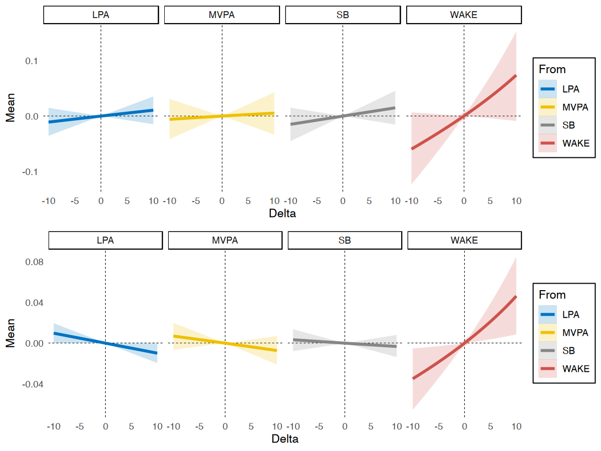

# Intro
When examining the relationship between a composition and an outconme,
we are often are interested in how an outcome changes when a fixed unit in the composition
(e.g., minutes of behaviours during a day) is reallocated
from one component to another. 
The Compositional Isotemporal Substitution Model can be used to estimate this change. 
The `multilevelcoda` package implements this method in a multilevel framework and offers functions 
for both between- and within-person levels of variability.
We discuss 4 different substitution models in this vignette.

We will begin by loading necessary packages, `multilevelcoda`, `brms` (for models fitting),
doFuture (for parallelisation), 
and data sets `mcompd` (simulated compositional sleep and wake variables),
`sbp` (sequential binary partition), and `psub` (base possible substitution).


```r
library(multilevelcoda)
library(brms)
library(doFuture)

data("mcompd") 
data("sbp")
data("psub")

options(digits = 3) # reduce number of digits shown
```

# Fitting main model
Let's fit our main `brms` model predicting `Stress` from both between and within-person
sleep-wake behaviours (represented by isometric log ratio coordinates), with sex as a covariate, 
using the `brmcoda()` function. We can compute ILR coordinate predictors using `compilr()` function.


```r
cilr <- compilr(data = mcompd, sbp = sbp,
                parts = c("TST", "WAKE", "MVPA", "LPA", "SB"), idvar = "ID", total = 1440)

m <- brmcoda(compilr = cilr,
             formula = Stress ~ bilr1 + bilr2 + bilr3 + bilr4 +
                                wilr1 + wilr2 + wilr3 + wilr4 + Female + (1 | ID),
             cores = 8, seed = 123, backend = "cmdstanr")
```

A `summary()` of the model results.


```r
summary(m)
#>  Family: gaussian 
#>   Links: mu = identity; sigma = identity 
#> Formula: Stress ~ bilr1 + bilr2 + bilr3 + bilr4 + wilr1 + wilr2 + wilr3 + wilr4 + Female + (1 | ID) 
#>    Data: tmp (Number of observations: 3540) 
#>   Draws: 4 chains, each with iter = 2000; warmup = 1000; thin = 1;
#>          total post-warmup draws = 4000
#> 
#> Group-Level Effects: 
#> ~ID (Number of levels: 266) 
#>               Estimate Est.Error l-95% CI u-95% CI Rhat Bulk_ESS Tail_ESS
#> sd(Intercept)     0.99      0.06     0.87     1.11 1.00     1574     2367
#> 
#> Population-Level Effects: 
#>           Estimate Est.Error l-95% CI u-95% CI Rhat Bulk_ESS Tail_ESS
#> Intercept     2.65      0.48     1.69     3.56 1.00     1494     2202
#> bilr1         0.11      0.32    -0.53     0.74 1.00      967     1699
#> bilr2         0.50      0.34    -0.16     1.15 1.00     1081     2071
#> bilr3         0.11      0.21    -0.31     0.53 1.00     1059     2057
#> bilr4         0.04      0.28    -0.51     0.60 1.00     1266     2174
#> wilr1        -0.34      0.12    -0.58    -0.09 1.00     2797     2882
#> wilr2         0.05      0.13    -0.21     0.32 1.00     3134     2299
#> wilr3        -0.10      0.08    -0.26     0.06 1.00     2712     2653
#> wilr4         0.24      0.10     0.04     0.44 1.00     2963     2874
#> Female       -0.41      0.17    -0.77    -0.07 1.00     1364     1823
#> 
#> Family Specific Parameters: 
#>       Estimate Est.Error l-95% CI u-95% CI Rhat Bulk_ESS Tail_ESS
#> sigma     2.38      0.03     2.33     2.44 1.00     4866     2981
#> 
#> Draws were sampled using sample(hmc). For each parameter, Bulk_ESS
#> and Tail_ESS are effective sample size measures, and Rhat is the potential
#> scale reduction factor on split chains (at convergence, Rhat = 1).
```

We can see that the first and forth within-person ILR coordinates were both associated with stress. 
Interpretation for multilevel ILR coordinates can often be less intuitive. 
For example, the significant coefficient for wilr1 shows that the within-person change in sleep behaviours 
(sleep duration and time awake in bed combined), relative to wake behaviours 
(moderate to vigorous physical activity, light physical activity, and sedentary behaviour) on a given day, 
is associated with stress. However, as there are
several behaviours involved in this coordinate, we don't know the within-person change in which of 
them drives the association. It could be the change in sleep, such that people sleep more than their 
own average on a given day, but it could also be the change in time awake. Further, we don't know 
about the specific changes in time spent across behaviours. That is, if people sleep more, what 
behaviour do they spend less time in?

This is common issue when working with multilevel compositional data as ILR coordinates often 
contains information about multiple compositional components. 
To gain further insights into these associations and help with interpretation, we can conduct 
post-hoc analyses using the substitution models from our `multilevel` package.

# Substitution models

`multilevelcoda` package provides `2` different methods to compute substitution models, via the
`substitution()` function.

Basic substitution models:

- *Between-person* substitution
- *Within-person* substitution

Average marginal substitution models:

- Average marginal *between-person* substitution
- Average marginal *within-person* substitution

*Tips: Substitution models are often computationally demanding tasks. You can speed up the models using parallel execution, for example, using `doFuture` package.*

## Basic Substitution model
The below example examines the changes in stress for different pairwise substitution of sleep-wake behaviours for a period of 1 to 5 minutes, at between-person level. 
We specify `level = between` to indicate substitutional change would be at the between-person level, 
and `ref = "grandmean"` to indicate substitution model using the grand compositional mean as reference composition.
If your model contains covariates, `substitution()` 
will average predictions across levels of covariates as the default.


```r
subm1 <- substitution(object = m, delta = 1:10,
                      ref = "grandmean", level = c("between", "within"))
```

Output from `substitution()` contains multiple data set of results for all available compositional component. 
Here are the results for changes in stress when sleep (TST) is substituted for 10 minutes.


```r
knitr::kable(summary(subm1, delta = 10, level = "between", to = "TST"))
```


| Mean| CI_low| CI_high| Delta|From |To  |Level   |Reference |
|----:|------:|-------:|-----:|:----|:---|:-------|:---------|
| 0.06|  -0.01|    0.13|    10|WAKE |TST |between |grandmean |
| 0.01|  -0.03|    0.04|    10|MVPA |TST |between |grandmean |
| 0.01|  -0.01|    0.03|    10|LPA  |TST |between |grandmean |
| 0.01|  -0.01|    0.04|    10|SB   |TST |between |grandmean |


None of them are significant, given that the credible intervals did not cross 0, showing that 
increasing sleep (TST) at the expense of any other behaviours was not associated 
in changes in stress at between-person level. 
These results can be plotted to see the patterns more easily using the `plot()` function.


```r
plot(subm1, to = "TST", level = "between", ref = "grandmean")
```


<div class="figure" style="text-align: center">

<p class="caption">Example of Between-person Substitution Model</p>
</div>

Here are the results for within-person level.


```r
knitr::kable(summary(subm1, delta = 10, level = "within", to = "TST"))
```


|  Mean| CI_low| CI_high| Delta|From |To  |Level  |Reference |
|-----:|------:|-------:|-----:|:----|:---|:------|:---------|
|  0.04|   0.01|    0.07|    10|WAKE |TST |within |grandmean |
| -0.01|  -0.02|    0.01|    10|MVPA |TST |within |grandmean |
| -0.01|  -0.02|    0.00|    10|LPA  |TST |within |grandmean |
|  0.00|  -0.01|    0.01|    10|SB   |TST |within |grandmean |


At within-person level, we got some significant results for substitution of sleep (TST) and time 
awake in bed (WAKE) for 5 minutes, but not other behaviours. 
Increasing 5 minutes in sleep at the expense of time spent awake 
in bed predicted 0.04 higher stress [95% CI 0.01, 0.7], on a given day. 
Let's also plot theses results.


```r
plot(subm1, to = "TST", level = "within", ref = "grandmean")
```


<div class="figure" style="text-align: center">

<p class="caption">Example of Within-person Substitution Model</p>
</div>

## Average Marginal Substitution Effects

The average marginal models use the unit compositional mean as the reference composition 
to obtain the average of the predicted group-level changes in the outcome when every unit
(e.g., individual) in the sample 
reallocates a specific unit from one compositional part to another. 
This is difference from the basic substitution model which yields prediction conditioned on 
an "average" person in the data set (e.g., by using the grand compositional mean
as the reference composition). 
Average substitution models models are generally more computationally expensive than basic subsitution models. All models can be run faster in shorter walltime using parallel execution. 
In this example, we use package `doFuture` to parallel our models. `substitution()` will run 5 
substitution models for 5 sleep-wake behaviours, so we will parallel them across 5 workers.


```r
registerDoFuture()
plan(multisession, workers = 5)

subm2 <- substitution(object = m, delta = 1:10,
                      ref = "clustermean", level = c("between", "within"))
registerDoSEQ()
```

Below are the results.


```r
knitr::kable(summary(subm2, delta = 10, to = "TST"))
```


|  Mean| CI_low| CI_high| Delta|To  |From |Level   |Reference   |
|-----:|------:|-------:|-----:|:---|:----|:-------|:-----------|
|  0.07|  -0.01|    0.15|    10|TST |WAKE |between |clustermean |
|  0.01|  -0.03|    0.04|    10|TST |MVPA |between |clustermean |
|  0.01|  -0.01|    0.04|    10|TST |LPA  |between |clustermean |
|  0.01|  -0.02|    0.05|    10|TST |SB   |between |clustermean |
|  0.05|   0.01|    0.08|    10|TST |WAKE |within  |clustermean |
| -0.01|  -0.02|    0.01|    10|TST |MVPA |within  |clustermean |
| -0.01|  -0.02|    0.00|    10|TST |LPA  |within  |clustermean |
|  0.00|  -0.01|    0.01|    10|TST |SB   |within  |clustermean |


A comparison between between- and within-person substitution model of sleep on stress, 
plot using `plot()` and `ggpubr::ggarrange()` functions.


```r
library(ggpubr)
p1 <- plot(subm2, to = "TST", level = "between", ref = "clustermean")
p2 <- plot(subm2, to = "TST", level = "within", ref = "clustermean")

ggarrange(p1, p2, 
          ncol = 1, nrow = 2)
```


<div class="figure" style="text-align: center">

<p class="caption">Example of Average Marginal Substitution Model</p>
</div>
