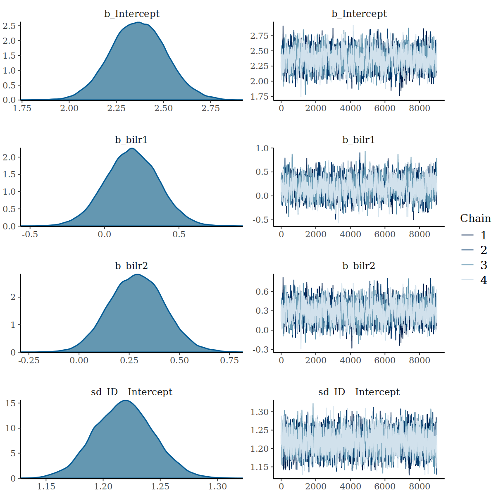

# Introduction
In this vignettes, we present a case study
we encountered in the simulation study for package `multilevelcoda`. 
Briefly, we found that 
multilevel model with compositional predictors with large sample size, 
large between-person heterogeneity and small within-person heterogeneity
(large $\sigma^2_{u}$ and small $\sigma^2_{\varepsilon}$)
produced low bulk effective sample size (ESS).
Here, we examined the diagnostics of the model of interest and explored different
methods to improve the within-chain autocorrelation.

# Generating Data from Simulation Study
We first generated a dataset consisting of a 3-part behaviour composition with
1200 individuals, 14 observations per individuals, and
large random intercept variation ($\sigma^2_{u} = 1.5$), coupled with 
small residual variation ($\sigma^2_{\varepsilon}: 0.5$).


```r
set.seed(1) 
sampled_cond <- cond[condition == "RElarge_RESsmall" & n_parts == 3 & N == 1200 & K == 14][1]
i <- 1

# condition
N             <- sampled_cond[i, N]
K             <- sampled_cond[i, K]
rint_sd       <- sampled_cond[i, rint_sd]
res_sd        <- sampled_cond[i, res_sd]
run           <- sampled_cond[i, run]
n_parts       <- sampled_cond[i, n_parts]
sbp_n         <- sampled_cond[i, sbp]
prefit_n      <- sampled_cond[i, prefit]
groundtruth_n <- sampled_cond[i, groundtruth]
parts         <- sampled_cond[i, parts]

# inputs
sbp           <- meanscovs[[paste(sbp_n)]]
prefit        <- get(prefit_n)
groundtruth   <- get(groundtruth_n)
parts         <- as.vector(strsplit(parts, " ")[[1]])

simd <- with(meanscovs, rbind(
  simulateData(
    bm = BMeans,
    wm = WMeans,
    bcov = BCov,
    wcov = WCov,
    n = N,
    k = K,
    psi = psi)
))

simd[, Sleep := TST + WAKE]
simd[, PA := MVPA + LPA]
# ILR ---------------------------------------------------
cilr <- compilr(
  data = simd,
  sbp = sbp,
  parts = parts,
  idvar = "ID")

tmp <- cbind(cilr$data,
             cilr$BetweenILR,
             cilr$WithinILR,
             cilr$TotalILR)

# random effects ----------------------------------------
redat <- data.table(ID = unique(tmp$ID),
                    rint = rnorm(
                      n = length(unique(tmp$ID)),
                      mean = 0,
                      sd = rint_sd))

tmp <- merge(tmp, redat, by = "ID")

# outcome -----------------------------------------------
if (n_parts == 3) {
  tmp[, sleepy :=  rnorm(
    n = nrow(simd),
    mean = groundtruth$b_Intercept  + rint +
      (groundtruth$b_bilr1 * bilr1) +
      (groundtruth$b_bilr2 * bilr2) +
      (groundtruth$b_wilr1 * wilr1) +
      (groundtruth$b_wilr2 * wilr2),
    sd = res_sd)]
}           
simd$sleepy <- tmp$sleepy

cilr <- compilr(simd, sbp, parts, total = 1440, idvar = "ID")
dat <- cbind(cilr$data, cilr$BetweenILR, cilr$WithinILR)
```

Here is the dataset `dat`, along with our variables of interest.


```r
knitr::kable(head(dat[, .(ID, sleepy, Sleep, PA, SB,
                          bilr1, bilr2, wilr1, wilr2)]))
```


| ID| sleepy| Sleep|    PA|  SB| bilr1| bilr2|  wilr1|  wilr2|
|--:|------:|-----:|-----:|---:|-----:|-----:|------:|------:|
|  1|   2.91|   437| 267.9| 735| 0.466| -1.16| -0.478|  0.447|
|  1|   1.02|   665| 116.2| 659| 0.466| -1.16|  0.250| -0.067|
|  1|   1.89|   526| 209.8| 704| 0.466| -1.16| -0.210|  0.304|
|  1|   1.88|   611|  89.7| 739| 0.466| -1.16|  0.240| -0.331|
|  1|   2.35|   488| 124.9| 827| 0.466| -1.16| -0.125| -0.177|
|  1|   2.03|   382| 201.4| 856| 0.466| -1.16| -0.534|  0.137|


# Example Models

The model of interest is a multilevel model with
3-part composition (Sleep, Physical Activity, Sedentary Behaviour), expressed
as a 2 sets of 2-part between and within- $ilr$ coordinates predicting sleepiness.


```r
fit <- brmcoda(cilr, 
               sleepy ~ bilr1 + bilr2 + wilr1 + wilr2 + (1 | ID),
               cores = 4,
               chains = 4,
               iter = 3000,
               warmup = 500,
               seed = 13,
               backend = "cmdstanr"
)
```


A summary of the model indicates that
the bulk ESS values for the constant and varying intercept as well as the constant coefficients
of the between $ilr$ coordinates are low.


```r
summary(fit)
#>  Family: gaussian 
#>   Links: mu = identity; sigma = identity 
#> Formula: sleepy ~ bilr1 + bilr2 + wilr1 + wilr2 + (1 | ID) 
#>    Data: tmp (Number of observations: 16800) 
#>   Draws: 4 chains, each with iter = 3000; warmup = 500; thin = 1;
#>          total post-warmup draws = 10000
#> 
#> Group-Level Effects: 
#> ~ID (Number of levels: 1200) 
#>               Estimate Est.Error l-95% CI u-95% CI Rhat Bulk_ESS Tail_ESS
#> sd(Intercept)     1.22      0.03     1.17     1.27 1.01      488      770
#> 
#> Population-Level Effects: 
#>           Estimate Est.Error l-95% CI u-95% CI Rhat Bulk_ESS Tail_ESS
#> Intercept     2.35      0.15     2.04     2.65 1.02      286      640
#> bilr1         0.19      0.18    -0.18     0.52 1.01      312      520
#> bilr2         0.28      0.14    -0.00     0.56 1.02      280      532
#> wilr1        -0.80      0.03    -0.85    -0.74 1.00     9447     7579
#> wilr2        -0.26      0.02    -0.31    -0.22 1.00     9731     7932
#> 
#> Family Specific Parameters: 
#>       Estimate Est.Error l-95% CI u-95% CI Rhat Bulk_ESS Tail_ESS
#> sigma     0.71      0.00     0.71     0.72 1.00    17695     7853
#> 
#> Draws were sampled using sample(hmc). For each parameter, Bulk_ESS
#> and Tail_ESS are effective sample size measures, and Rhat is the potential
#> scale reduction factor on split chains (at convergence, Rhat = 1).
```

Further inspection of density and trace lots for these parameters show 
some areas of the samples being drawn from outside of the parameter space,
but no strong evidence for non-convergence.


```r
plot(fit, variable = c("b_Intercept", "b_bilr1", "b_bilr2", "sd_ID__Intercept"), regex = TRUE)
```

<div class="figure" style="text-align: center">

<p class="caption">Density and Trace Plot of Parameters with Low ESS</p>
</div>

# Improving within-chain autocorrelation of MCMC sampling
The low bulk ESS for random intercept model has been observed previously, for example,
see  
[here](https://discourse.mc-stan.org/t/low-ess-and-high-rhat-for-random-intercept-slope-simulation-rstan-and-rstanarm/9985/6)
and [here](https://discourse.mc-stan.org/t/low-bulk-ess-simple-random-intercept-model/23181/2).
We explored two potential solution to improve MCMC sampling efficiency:
increasing posterior draws and reparameterisation.

## Increased posterior draws
As a first step, we test if increasing iterations and warmups helps.


```r
fit_it <- brmcoda(cilr, 
                  sleepy ~ bilr1 + bilr2 + wilr1 + wilr2 + (1 | ID),
                  cores = 4,
                  chains = 4,
                  iter = 10000,
                  warmup = 1000,
                  seed = 13,
                  backend = "cmdstanr"
)
print(rstan::get_elapsed_time(fit$Model$fit_it))
#> Error in object@mode: no applicable method for `@` applied to an object of class "NULL"
```


```r
summary(fit_it)
#>  Family: gaussian 
#>   Links: mu = identity; sigma = identity 
#> Formula: sleepy ~ bilr1 + bilr2 + wilr1 + wilr2 + (1 | ID) 
#>    Data: tmp (Number of observations: 16800) 
#>   Draws: 4 chains, each with iter = 10000; warmup = 1000; thin = 1;
#>          total post-warmup draws = 36000
#> 
#> Group-Level Effects: 
#> ~ID (Number of levels: 1200) 
#>               Estimate Est.Error l-95% CI u-95% CI Rhat Bulk_ESS Tail_ESS
#> sd(Intercept)     1.22      0.03     1.17     1.27 1.00     1997     3971
#> 
#> Population-Level Effects: 
#>           Estimate Est.Error l-95% CI u-95% CI Rhat Bulk_ESS Tail_ESS
#> Intercept     2.37      0.15     2.08     2.66 1.00     1130     2114
#> bilr1         0.18      0.18    -0.17     0.54 1.01      938     2477
#> bilr2         0.29      0.14     0.03     0.56 1.00     1182     2510
#> wilr1        -0.80      0.03    -0.85    -0.74 1.00    44344    28415
#> wilr2        -0.26      0.02    -0.31    -0.22 1.00    47155    29351
#> 
#> Family Specific Parameters: 
#>       Estimate Est.Error l-95% CI u-95% CI Rhat Bulk_ESS Tail_ESS
#> sigma     0.71      0.00     0.71     0.72 1.00    62444    27585
#> 
#> Draws were sampled using sample(hmc). For each parameter, Bulk_ESS
#> and Tail_ESS are effective sample size measures, and Rhat is the potential
#> scale reduction factor on split chains (at convergence, Rhat = 1).
```


```r
plot(fit_it, variable = c("b_Intercept", "b_bilr1", "b_bilr2", "sd_ID__Intercept"), regex = TRUE)
```

<div class="figure" style="text-align: center">

<p class="caption">Density and Trace Plot after increasing iterations and warmups</p>
</div>

It is a good sign that increasing interation and warmups increase the ESS, supported by trace plots.
The ratios of ESS of `b_Intercept`, `b_bilr1`, `b_bilr2` and `sd_ID_intercept` 
to `b_wilr1`, `b_wilr2`, and `sigma` remain somewhat a concern. 

## Centered Parameterisation
By default, `brms` uses the non-centered parametrization.
However, 
@betancourt2015 explains correlation
depends on the amount of data, and
the efficacy of the parameterization depends on the relative strength of the data.
For small data sets, the computational implementation of the model using non-parameterisation is more efficient. 
When there is enough data, however,
this parameterization is unnecessary and it may be more efficient to use the centered parameterisation.
Reparameterisation is further discussed 
in [Betancourt's case study](https://betanalpha.github.io/assets/case_studies/hierarchical_modeling.html) and
[Nicenboim, Schad, and Vasishth's chapter on complex models and reparameterisation](https://bruno.nicenboim.me/bayescogsci/).

Given that there is a small variation in our large simulated data set,
we are going to test if centered parameterisation improves the sampling.
We first obtain the Stan code for the example model


```r
make_stancode(sleepy ~ bilr1 + bilr2 + wilr1 + wilr2 + (1 | ID), data = dat)
#> // generated with brms 2.19.0
#> functions {
#> }
#> data {
#>   int<lower=1> N;  // total number of observations
#>   vector[N] Y;  // response variable
#>   int<lower=1> K;  // number of population-level effects
#>   matrix[N, K] X;  // population-level design matrix
#>   // data for group-level effects of ID 1
#>   int<lower=1> N_1;  // number of grouping levels
#>   int<lower=1> M_1;  // number of coefficients per level
#>   int<lower=1> J_1[N];  // grouping indicator per observation
#>   // group-level predictor values
#>   vector[N] Z_1_1;
#>   int prior_only;  // should the likelihood be ignored?
#> }
#> transformed data {
#>   int Kc = K - 1;
#>   matrix[N, Kc] Xc;  // centered version of X without an intercept
#>   vector[Kc] means_X;  // column means of X before centering
#>   for (i in 2:K) {
#>     means_X[i - 1] = mean(X[, i]);
#>     Xc[, i - 1] = X[, i] - means_X[i - 1];
#>   }
#> }
#> parameters {
#>   vector[Kc] b;  // population-level effects
#>   real Intercept;  // temporary intercept for centered predictors
#>   real<lower=0> sigma;  // dispersion parameter
#>   vector<lower=0>[M_1] sd_1;  // group-level standard deviations
#>   vector[N_1] z_1[M_1];  // standardized group-level effects
#> }
#> transformed parameters {
#>   vector[N_1] r_1_1;  // actual group-level effects
#>   real lprior = 0;  // prior contributions to the log posterior
#>   r_1_1 = (sd_1[1] * (z_1[1]));
#>   lprior += student_t_lpdf(Intercept | 3, 2.1, 2.5);
#>   lprior += student_t_lpdf(sigma | 3, 0, 2.5)
#>     - 1 * student_t_lccdf(0 | 3, 0, 2.5);
#>   lprior += student_t_lpdf(sd_1 | 3, 0, 2.5)
#>     - 1 * student_t_lccdf(0 | 3, 0, 2.5);
#> }
#> model {
#>   // likelihood including constants
#>   if (!prior_only) {
#>     // initialize linear predictor term
#>     vector[N] mu = rep_vector(0.0, N);
#>     mu += Intercept;
#>     for (n in 1:N) {
#>       // add more terms to the linear predictor
#>       mu[n] += r_1_1[J_1[n]] * Z_1_1[n];
#>     }
#>     target += normal_id_glm_lpdf(Y | Xc, mu, b, sigma);
#>   }
#>   // priors including constants
#>   target += lprior;
#>   target += std_normal_lpdf(z_1[1]);
#> }
#> generated quantities {
#>   // actual population-level intercept
#>   real b_Intercept = Intercept - dot_product(means_X, b);
#> }
```

We then can manually edit the generated brms code to center all parameters.
The modified Stan code is


```r
m_centered <- cmdstan_model("fit_centered.stan")
print(m_centered)
#> data {
#>   int<lower=1> N;  // total number of observations
#>   vector[N] Y;  // response variable
#>   int<lower=1> K;  // number of population-level effects
#>   matrix[N, K] X;  // population-level design matrix
#>   // data for group-level effects of ID 1
#>   int<lower=1> N_1;  // number of grouping levels
#>   int<lower=1> M_1;  // number of coefficients per level
#>   int<lower=1> J_1[N];  // grouping indicator per observation
#>   // group-level predictor values
#>   vector[N] Z_1_1;
#>   int prior_only;  // should the likelihood be ignored?
#> }
#> transformed data {
#>   int Kc = K - 1;
#>   matrix[N, Kc] Xc;  // centered version of X without an intercept
#>   vector[Kc] means_X;  // column means of X before centering
#>   for (i in 2:K) {
#>     means_X[i - 1] = mean(X[, i]);
#>     Xc[, i - 1] = X[, i] - means_X[i - 1];
#>   }
#> }
#> parameters {
#>   vector[Kc] b;  // population-level effects
#>   real Intercept;  // temporary intercept for centered predictors
#>   real<lower=0> sigma;  // dispersion parameter
#>   vector<lower=0>[M_1] sd_1;  // group-level standard deviations
#>   vector[N_1] z_1[M_1];  // standardized group-level effects
#>   
#>   // Manually added
#>    vector[N_1] r_1_1;  // actual group-level effects
#> }
#> //transformed parameters {
#> //  vector[N_1] r_1_1;  // actual group-level effects
#> //  real lprior = 0;  // prior contributions to the log posterior
#> //  r_1_1 = (sd_1[1] * (z_1[1]));
#> //  lprior += student_t_lpdf(Intercept | 3, 2, 2.5);
#> //  lprior += student_t_lpdf(sigma | 3, 0, 2.5)
#> //    - 1 * student_t_lccdf(0 | 3, 0, 2.5);
#> //  lprior += student_t_lpdf(sd_1 | 3, 0, 2.5)
#> //    - 1 * student_t_lccdf(0 | 3, 0, 2.5);
#> //}
#> model {
#>   // likelihood including constants
#>   if (!prior_only) {
#>     // initialize linear predictor term
#>     vector[N] mu = rep_vector(0.0, N);
#>     mu += Intercept;
#>     for (n in 1:N) {
#>       // add more terms to the linear predictor
#>       mu[n] += r_1_1[J_1[n]] * Z_1_1[n];
#>       
#>     }
#>     target += normal_id_glm_lpdf(Y | Xc, mu, b, sigma);
#>   }
#>   // priors including constants
#>   // target += lprior;
#>   // target += std_normal_lpdf(z_1[1]);
#> 
#>   target += student_t_lpdf(Intercept | 3, 2, 2.5);
#>   target += student_t_lpdf(sigma | 3, 0, 2.5)
#>     - 1 * student_t_lccdf(0 | 3, 0, 2.5);
#>   target += student_t_lpdf(sd_1 | 3, 0, 2.5)
#>     - 1 * student_t_lccdf(0 | 3, 0, 2.5);
#>     
#>   // Manually added
#>   target += normal_lpdf(r_1_1 | 0, sd_1[1]);
#> 
#>   // manual soft sum to zero constraint
#>   // target += normal_lpdf(sum(r_1_1) | 0, 0.0001 *N_1);
#> }
#> generated quantities {
#>   // actual population-level intercept
#>   real b_Intercept = Intercept - dot_product(means_X, b);
#> }
```

Now we build data for the model and sample with `cmdstanr`


```r
sdat <- make_standata(sleepy ~ bilr1 + bilr2 + wilr1 + wilr2 + (1 | ID), data = dat)
fit_centered <- m_centered$sample(data = sdat,
                                  parallel_chains = 4,
                                  iter_sampling = 2500,
                                  iter_warmup = 500)
```


```r
bm_centered <- brm(sleepy ~ bilr1 + bilr2 + wilr1 + wilr2 + (1 | ID), data = dat, empty = TRUE)
bm_centered$fit <- rstan::read_stan_csv(fit_centered$output_files())
bm_centered <- rename_pars(bm_centered)
```


```r
summary(bm_centered)
#>  Family: gaussian 
#>   Links: mu = identity; sigma = identity 
#> Formula: sleepy ~ bilr1 + bilr2 + wilr1 + wilr2 + (1 | ID) 
#>    Data: dat (Number of observations: 16800) 
#>   Draws: 4 chains, each with iter = 3000; warmup = 500; thin = 1;
#>          total post-warmup draws = 10000
#> 
#> Group-Level Effects: 
#> ~ID (Number of levels: 1200) 
#>               Estimate Est.Error l-95% CI u-95% CI Rhat Bulk_ESS Tail_ESS
#> sd(Intercept)     1.22      0.03     1.17     1.27 1.00     9848     9674
#> 
#> Population-Level Effects: 
#>           Estimate Est.Error l-95% CI u-95% CI Rhat Bulk_ESS Tail_ESS
#> Intercept     2.36      0.15     2.06     2.66 1.00    10497     5483
#> bilr1         0.19      0.18    -0.17     0.55 1.00    10539     5853
#> bilr2         0.29      0.14     0.01     0.56 1.00    10683     5784
#> wilr1        -0.80      0.03    -0.85    -0.74 1.00    10030     7217
#> wilr2        -0.26      0.02    -0.31    -0.22 1.00     9805     7335
#> 
#> Family Specific Parameters: 
#>       Estimate Est.Error l-95% CI u-95% CI Rhat Bulk_ESS Tail_ESS
#> sigma     0.71      0.00     0.71     0.72 1.00     8197     6616
#> 
#> Draws were sampled using sample(hmc). For each parameter, Bulk_ESS
#> and Tail_ESS are effective sample size measures, and Rhat is the potential
#> scale reduction factor on split chains (at convergence, Rhat = 1).
```

Indeed, the centered parameterisation has improved the ESS for all parameters.


```r
plot(bm_centered, pars = c("b_Intercept", "b_bilr1", "b_bilr2", "sd_ID__Intercept"), regex = TRUE)
```

<div class="figure" style="text-align: center">

<p class="caption">Density and Trace Plot when using centered parameterisation</p>
</div>

# Computational Time


```r
# example model
print(rstan::get_elapsed_time(fit$Model$fit))
#>         warmup sample
#> chain:1   16.7   36.6
#> chain:2   14.6   36.6
#> chain:3   19.3   36.3
#> chain:4   15.4   36.7

# increased iter
print(rstan::get_elapsed_time(fit_it$Model$fit))
#>         warmup sample
#> chain:1   23.2    128
#> chain:2   20.9    129
#> chain:3   25.3    129
#> chain:4   21.8    129

# centered parameterisation
rstan::get_elapsed_time(bm_centered$fit)
#>         warmup sample
#> chain:1    200   1125
#> chain:2    199   1121
#> chain:3    202   1121
#> chain:4    200   1124
```
It took 607.051 to obtain an average-ish of 1000
across the four parameters with initially low ESS.
To achieve an ESS of 10 000 across all parameters,
simplying increasing iterations should take around 6070.51,
whereas centered parameterisation takes around 5292.319.

# Conclusion
`multilevelcoda` demonstrates excellent performances across different conditions
of number of individuals, number of observations, number of compositional parts, and
magnitude of modeled variance
(full results of simulation study will be published at a later date).
However,
in the case of large data and small sample variation, 
we recommend centered parameterisation or increasing iterations to 
achieve efficient MCMC sampling.
Based on results of the case study,
centered parameterisation would give 
more reliable results in terms of ESS-to-draw ratios for all parameters and computational time.

# References
