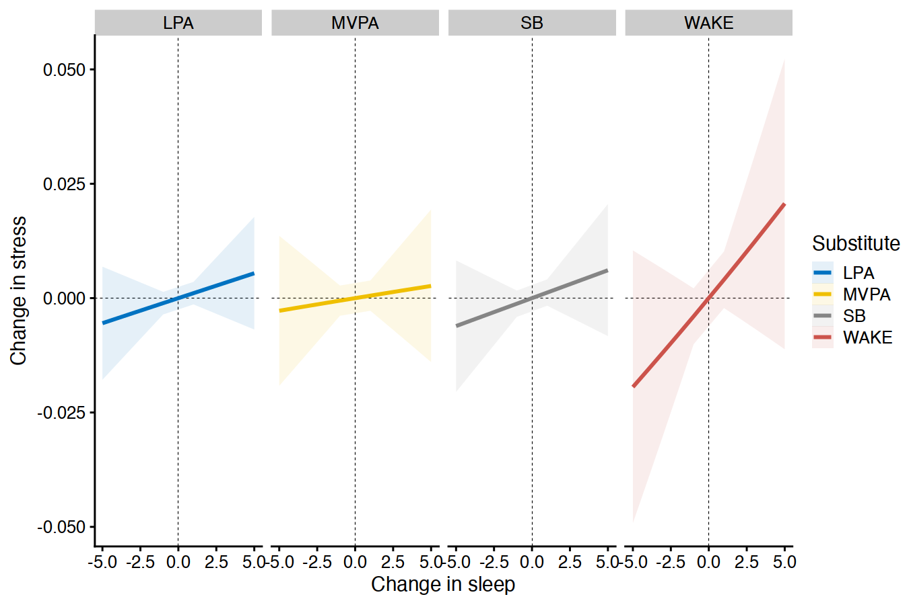
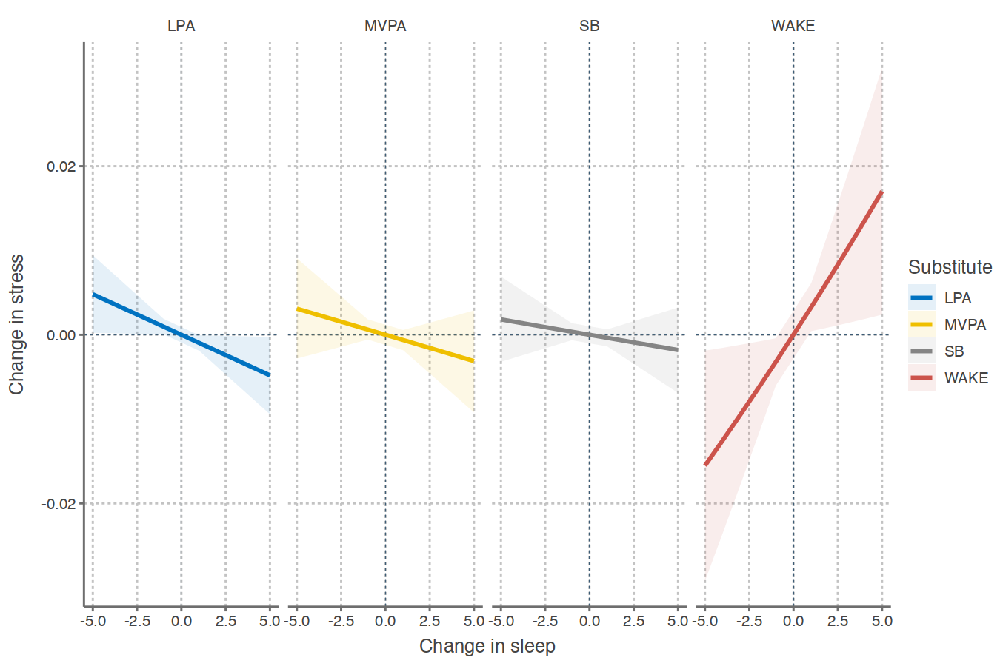

In this vignette, we discuss how to specify multilevel models with compositional data using `multilevelcoda`.

In addition to `multilevelcoda` package, we will use `brms` (to fit models) and
`bayestestR` (to compute useful indices and compare models), and
`doFuture` (to parallel models).


```r
library(multilevelcoda)
library(brms)
library(bayestestR)
library(doFuture)

options(digits = 3) # reduce number of digits shown
```

We will also attach built in datasets `mcompd` (simulated compositional sleep and wake variables)  `sbp` (sequential binary partition), and `psub` (base possible substitution).


```r
data("mcompd") 
data("sbp")
data("psub")
```
# Multilevel model with compositional predictors
## Compositions and isometric log ratio (ILR) coordinates. 

Compositional data are often expressed as a set of ILR coordinates in regression models 
(Egozcue et al., 2003).
Using the `compilr()`, we can get ILR coordinates 
that are used in the subsequent model as the predictors or outcomes.


```r
cilr <- compilr(data = mcompd, sbp = sbp,
                parts = c("TST", "WAKE", "MVPA", "LPA", "SB"), idvar = "ID")
```

## Fitting model
We now will use output from the `compilr()` to fit our `brms` model,
using the `brmcoda()`. Here is a model predicting `STRESS`
from between- and within-person sleep-wake behaviours (expressed as ILR coordinates).

Note: make sure you pass the correct names of the ILR coordinates to `brms` model.


```r
m <- brmcoda(compilr = cilr,
             formula = STRESS ~ bilr1 + bilr2 + bilr3 + bilr4 +
               wilr1 + wilr2 + wilr3 + wilr4 + (1 | ID),
             cores = 8, seed = 123, backend = "cmdstanr")
#> Compiling Stan program...
#> Start sampling
```

Here is a `summary()` of the model results.


```r
summary(m$Model)
#>  Family: gaussian 
#>   Links: mu = identity; sigma = identity 
#> Formula: STRESS ~ bilr1 + bilr2 + bilr3 + bilr4 + wilr1 + wilr2 + wilr3 + wilr4 + (1 | ID) 
#>    Data: tmp (Number of observations: 3540) 
#>   Draws: 4 chains, each with iter = 2000; warmup = 1000; thin = 1;
#>          total post-warmup draws = 4000
#> 
#> Group-Level Effects: 
#> ~ID (Number of levels: 266) 
#>               Estimate Est.Error l-95% CI u-95% CI Rhat Bulk_ESS Tail_ESS
#> sd(Intercept)     1.00      0.06     0.88     1.13 1.00     1370     2369
#> 
#> Population-Level Effects: 
#>           Estimate Est.Error l-95% CI u-95% CI Rhat Bulk_ESS Tail_ESS
#> Intercept     2.56      0.49     1.64     3.50 1.00     1011     1819
#> bilr1         0.17      0.33    -0.49     0.82 1.00      987     1601
#> bilr2         0.41      0.35    -0.28     1.08 1.00      964     2099
#> bilr3         0.12      0.21    -0.29     0.54 1.00     1091     1861
#> bilr4        -0.04      0.29    -0.59     0.52 1.00     1001     1775
#> wilr1        -0.34      0.12    -0.58    -0.10 1.00     3280     3276
#> wilr2         0.04      0.13    -0.21     0.29 1.00     3576     3033
#> wilr3        -0.11      0.08    -0.25     0.04 1.00     3196     2789
#> wilr4         0.24      0.10     0.05     0.43 1.00     3769     2893
#> 
#> Family Specific Parameters: 
#>       Estimate Est.Error l-95% CI u-95% CI Rhat Bulk_ESS Tail_ESS
#> sigma     2.37      0.03     2.31     2.42 1.00     5037     3013
#> 
#> Draws were sampled using sample(hmc). For each parameter, Bulk_ESS
#> and Tail_ESS are effective sample size measures, and Rhat is the potential
#> scale reduction factor on split chains (at convergence, Rhat = 1).
```

Results show that the first and forth within-person ILR coordinate was associated with stress.
The interpretation of these outputs depends on how you construct your sequential binary partition.
For the built-in sequential binary partition `sbp`, TODO add a table to show partition.

| ILR coordinates | What it means                                 |
|----------------|----------------------------------------------|
| bilr1 | Sleep vs wake behaviours at between-person level |
| bilr2 | Sleep vs awake in bed at between-person level  | 
| bilr3 | MVPA vs (LPA and SB) at between-person level | 
| bilr4 | LPA vs SB at between-person level |
| wilr1 | Sleep vs wake behaviours at between-person level |
| wilr2 | Sleep vs awake in bed at within-person level |
| wilr3 | MVPA vs (LPA and SB) at within-person level |
| wilr4 | LPA vs SB at within-person level|

Due to the nature of within-person ILR coordinates, it is often challenging to interpret these 
results in great details.
For example,  the significant coefficient for wilr1 shows that the within-person change in sleep behaviours
(sleep duration and time awake in bed combined), relative to wake behaviours (moderate to vigorous
physical activity, light physical activity, and sedentary behaviour) on a given day, was associated 
with stress. However, as there are several behaviours involved in this coordinate, we don't know the
within-person change in which of them drives the association. It could be the change in sleep, such 
that people sleep more than their own average on a given day, but it could also be the change in time 
awake. Further, we don't know about the specific changes in time spent across behaviours. That is, 
if people slept more, what behaviour did they spend less time in?

One approach to gain further insights into these relationships, and the changes in outcomes associated with changes in specific time across behaviours is the substitution model. 
We will discuss the substitution model later in this vignette.

## Bayes Factor for significance testing

In the frequentist approach, we usually compare the fits of models using `anova()`.
In Bayesian, this can be done by comparing the marginal likelihoods of two models.

Bayes Factors (BFs) are indices of relative evidence of one model over another. 
In the context of compositional multilevel modelling, Bayes Factors provide two main useful functions:
- testing single parameters within a model
- comparing models

We can utilize Bayes factors to answer the following question:

*"Which model is more likely to have produced the observed data?"*

Let's fit a series of model with `brmcoda()` to predict `STRESS` from sleep-wake composition.
For precise Bayes factors, we will use 40,000 posterior draws for each model.

*Note*: To use Bayes factors, `brmsfit` models must be fitted with an additional non-default argument
`save_pars = save_pars(all = TRUE)`.


```r
# intercept only model
m0 <- brmcoda(compilr = cilr,
             formula = STRESS ~ 1 + (1 | ID),
             iter = 6000, chains = 8, cores = 8, seed = 123, warmup = 1000,
             backend = "cmdstanr", save_pars = save_pars(all = TRUE))
#> Compiling Stan program...
#> Start sampling

# between-person composition only model
m1 <- brmcoda(compilr = cilr,
             formula = STRESS ~ bilr1 + bilr2 + bilr3 + bilr4 + (1 | ID),
             iter = 6000, chains = 8, cores = 8, seed = 123, warmup = 1000,
             backend = "cmdstanr", save_pars = save_pars(all = TRUE))
#> Compiling Stan program...
#> Start sampling

# within-person composition only model
m2 <- brmcoda(compilr = cilr,
             formula = STRESS ~ wilr1 + wilr2 + wilr3 + wilr4 + (1 | ID),
             iter = 6000, chains = 8, cores = 8, seed = 123, warmup = 1000,
             backend = "cmdstanr", save_pars = save_pars(all = TRUE))
#> Compiling Stan program...
#> Start sampling

# full model
m <- brmcoda(compilr = cilr,
             formula = STRESS ~ bilr1 + bilr2 + bilr3 + bilr4 +
               wilr1 + wilr2 + wilr3 + wilr4 + (1 | ID),
             iter = 6000, chains = 8, cores = 8, seed = 123, warmup = 1000,
             backend = "cmdstanr", save_pars = save_pars(all = TRUE))
#> Compiling Stan program...
#> Start sampling
```

We can now compare these models with the `bayesfactor_models()` function, using the intercept-only 
model as reference.


```r
comparison <- bayesfactor_models(m$Model, m1$Model, m2$Model, denominator = m0$Model)
#> Computation of Bayes factors: estimating marginal likelihood, please wait...
#> Recompiling the model with 'rstan'
#> Recompilation done
#> Recompiling the model with 'rstan'
#> Recompilation done
#> Recompiling the model with 'rstan'
#> Recompilation done
#> Recompiling the model with 'rstan'
#> Recompilation done
```


```r
comparison
#> Bayes Factors for Model Comparison
#> 
#>     Model                                                                       BF
#> [1] bilr1 + bilr2 + bilr3 + bilr4 + wilr1 + wilr2 + wilr3 + wilr4 + (1 | ID)  4.06
#> [2] bilr1 + bilr2 + bilr3 + bilr4 + (1 | ID)                                 0.348
#> [3] wilr1 + wilr2 + wilr3 + wilr4 + (1 | ID)                                 12.09
#> 
#> * Against Denominator: [4] 1 + (1 | ID)
#> *   Bayes Factor Type: marginal likelihoods (bridgesampling)
```

We can see that model with only within-person composition is the best model - with $BF$ = 11.86 compared to the null (intercept only).

Let's compare these models against the full model.


```r
update(comparison, reference = 1)
#> Bayes Factors for Model Comparison
#> 
#>     Model                                       BF
#> [2] bilr1 + bilr2 + bilr3 + bilr4 + (1 | ID) 0.086
#> [3] wilr1 + wilr2 + wilr3 + wilr4 + (1 | ID)  2.98
#> [4] 1 + (1 | ID)                             0.246
#> 
#> * Against Denominator: [1] bilr1 + bilr2 + bilr3 + bilr4 + wilr1 + wilr2 + wilr3 + wilr4 + (1 | ID)
#> *   Bayes Factor Type: marginal likelihoods (bridgesampling)
```

Again, our data favours the within-person composition only model over the full model, giving 2.93 times more support.

Bayes factors provide a intuitive measure of the strength of evidence of one model over the other
or among different models. Check out the `bayestestR` packages for several other useful functions related to BFs.

# Substitution model
When examining the relationships between compositional data and an outcome, we often are also interested in the changes in an outcomes when a fixed duration of time is reallocated
from one behaviour to another, while the other behaviours remain constant. These changes can be examined using the compositional isotemporal substitution model (Dumuid et a., 2019). 
In `multilevelcoda`, we extend this model to multilevel approach to test both between-person and within-person changes.

## Between-person substitution model

Between-person substitution model can be computed using the `bsub()` function. The below example 
examines the changes in stress for different pairwise substitution of sleep-wake behaviours
for a period of 1 to 5 minutes, at between-person level. 


```r
bsubm <- bsub(objec = m, substitute = psub, minute = 5)
```

Output from `bsub()` contains multiple dataset of results for all available compositional component. 
Here are the results for changes in stress when sleep (TST) is substituted for 5 minutes, averaged across levels of covariates. For ease of presentation, we only show the $\pm5$ minute 
substitution results, but the full dataset would contain similar results for 1, 2, etc. minute substitutions.


```r
knitr::kable(bsubm$TST[abs(MinSubstituted) == 5])
```


|   Mean| CI_low| CI_high| MinSubstituted|Substitute |Predictor |
|------:|------:|-------:|--------------:|:----------|:---------|
|  0.021| -0.011|   0.052|              5|WAKE       |TST       |
|  0.003| -0.014|   0.019|              5|MVPA       |TST       |
|  0.005| -0.007|   0.018|              5|LPA        |TST       |
|  0.006| -0.008|   0.021|              5|SB         |TST       |
| -0.019| -0.049|   0.010|             -5|WAKE       |TST       |
| -0.003| -0.019|   0.014|             -5|MVPA       |TST       |
| -0.005| -0.018|   0.007|             -5|LPA        |TST       |
| -0.006| -0.021|   0.008|             -5|SB         |TST       |

None of the results are significant, given that the credible intervals did not cross 0, showing that 
increasing sleep (TST) at the expense of any other behaviours was not associated in changes in stress.

These results can be plotted to see the patterns more easily using the `plotsub()` function.


```r
plotsub(data = bsubm$TST, x = "sleep", y = "stress")
```


```r
plotsub(data = bsubm$TST, x = "sleep", y = "stress") +
  scale_color_jco() +
  scale_fill_jco() + 
  theme_cowplot()
```



### Within-person substitution model
Let's now take a look at how stress changes when different pairwise of sleep-wake behaviours are
substituted for a period of 1 to 5 minutes, at within-person level. 


```r
# Within-person substitution
wsubm <- wsub(objec = m, substitute = psub, minute = 5, summary = TRUE)
```

Results for 5 minute substitution.


```r
knitr::kable(wsubm$TST[abs(MinSubstituted) == 5])
```


|   Mean| CI_low| CI_high| MinSubstituted|Substitute |Predictor |
|------:|------:|-------:|--------------:|:----------|:---------|
|  0.017|  0.002|   0.032|              5|WAKE       |TST       |
| -0.003| -0.009|   0.003|              5|MVPA       |TST       |
| -0.005| -0.009|   0.000|              5|LPA        |TST       |
| -0.002| -0.007|   0.003|              5|SB         |TST       |
| -0.016| -0.029|  -0.002|             -5|WAKE       |TST       |
|  0.003| -0.003|   0.009|             -5|MVPA       |TST       |
|  0.005|  0.000|   0.009|             -5|LPA        |TST       |
|  0.002| -0.003|   0.007|             -5|SB         |TST       |

At within-person level, we got some significant results for substitution of sleep (TST) and time 
awake in bed (WAKE) for 5 minutes, but not other behaviours. Increasing sleep at the expense of time spent awake 
in bed predicted 0.02 higher stress [95% CI 0.00, 0.03], on a given day. Conversely, less sleep and 
more time awake in bed predicted less stress (b = -0.016 [95% CI -0.03,	-0.00]). Notice there is no 
column indicating the levels of convariates, indicating that these results have been averaged. 

Let's also plot theses results.


```r
plotsub(data = wsubm$TST, x = "sleep", y = "stress")
```


```r
plotsub(data = wsubm$TST, x = "sleep", y = "stress") +
  scale_color_jco() +
  scale_fill_jco() + 
  theme_cowplot()
```




### More about interesting substitution models
You can learn more about different types of substitution models at  
[Compositional Multilevel Substitution Models](https://florale.github.io/multilevelcoda/articles/substitution-model.html).

## References

Dumuid, D., Pedišić, Ž., Stanford, T. E., Martín-Fernández, J. A., Hron, K., Maher, C. A., ... & Olds, T. (2019). The compositional isotemporal substitution model: a method for estimating changes in a health outcome for reallocation of time between sleep, physical activity and sedentary behaviour. Statistical methods in medical research, 28(3), 846-857.

Egozcue, J. J., Pawlowsky-Glahn, V., Mateu-Figueras, G., & Barcelo-Vidal, C. (2003). Isometric logratio transformations for compositional data analysis. Mathematical geology, 35(3), 279-300.
