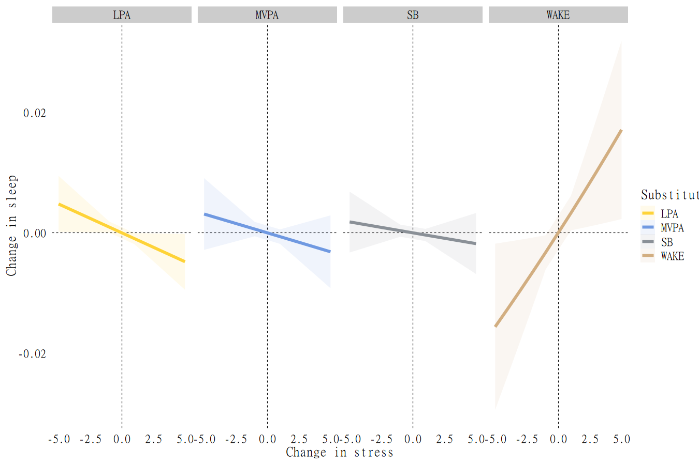
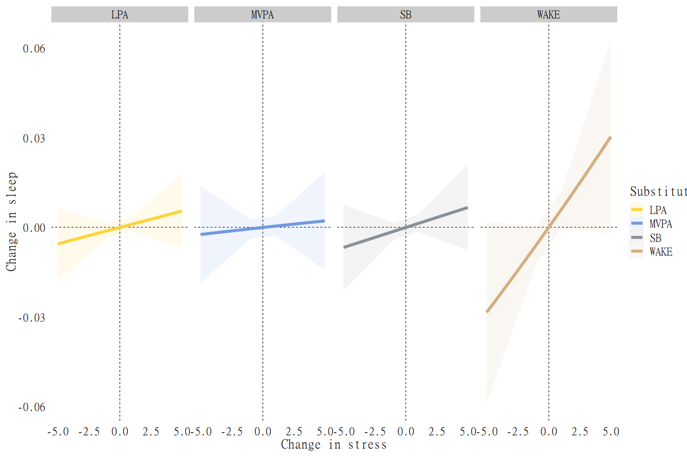

In this vignette, we discuss how to specify multilevel models with compositional predictor using `multilevelcoda`.

To begin with, we need to load several packages and attach 
built in datasets with simulated compositional sleep and wake variables.


```r
library(multilevelcoda)
library(brms)
#> Loading required package: Rcpp
#> Loading 'brms' package (version 2.17.0). Useful instructions
#> can be found by typing help('brms'). A more detailed introduction
#> to the package is available through vignette('brms_overview').
#> 
#> Attaching package: 'brms'
#> The following object is masked from 'package:stats':
#> 
#>     ar
library(bayestestR)
library(doFuture)
#> Loading required package: foreach
#> Loading required package: future

data("mcompd") # dataset with compositional variables
data("psub") # base possible substitution data
data("sbp") # sequential binary partitition

options(digits = 3) # reduce number of digits shown
```

## Getting compositions and isometric log ratio (ILR) coordinates. 

This uses the `compilr()` function.
The coordinates are used in the subsequent model as the predictors


```r
cilr <- compilr(data = mcompd, sbp = sbp,
                parts = c("TST", "WAKE", "MVPA", "LPA", "SB"), idvar = "ID")
```

## Multilevel model with compositional predictors

We now will use output from the `compilr()` function for our `brms` model,
fit using the `brmcoda()` function.


```r
m <- brmcoda(compilr = cilr,
             formula = STRESS ~ bilr1 + bilr2 + bilr3 + bilr4 +
               wilr1 + wilr2 + wilr3 + wilr4 + Female + (1 | ID),
             chain = 8, cores = 8, iter = 8000, seed = 123,
             save_pars = save_pars(all = TRUE),
             backend = "cmdstanr")
#> Compiling Stan program...
#> Start sampling
```

Here is a `summary()` of the model results.


```r
summary(m$Model)
#>  Family: gaussian 
#>   Links: mu = identity; sigma = identity 
#> Formula: STRESS ~ bilr1 + bilr2 + bilr3 + bilr4 + wilr1 + wilr2 + wilr3 + wilr4 + Female + (1 | ID) 
#>    Data: tmp (Number of observations: 3540) 
#>   Draws: 8 chains, each with iter = 8000; warmup = 4000; thin = 1;
#>          total post-warmup draws = 32000
#> 
#> Group-Level Effects: 
#> ~ID (Number of levels: 266) 
#>               Estimate Est.Error l-95% CI u-95% CI Rhat Bulk_ESS Tail_ESS
#> sd(Intercept)     0.99      0.06     0.87     1.11 1.00    11442    17325
#> 
#> Population-Level Effects: 
#>           Estimate Est.Error l-95% CI u-95% CI Rhat Bulk_ESS Tail_ESS
#> Intercept     2.64      0.48     1.71     3.57 1.00    10217    17029
#> bilr1         0.11      0.32    -0.51     0.73 1.00     9146    15395
#> bilr2         0.51      0.34    -0.16     1.18 1.00     8964    15316
#> bilr3         0.13      0.21    -0.28     0.55 1.00     9118    16058
#> bilr4         0.00      0.28    -0.55     0.55 1.00     9421    16324
#> wilr1        -0.35      0.12    -0.58    -0.11 1.00    23307    24217
#> wilr2         0.05      0.13    -0.22     0.31 1.00    27142    24311
#> wilr3        -0.11      0.08    -0.26     0.05 1.00    23328    24003
#> wilr4         0.24      0.10     0.04     0.43 1.00    24419    24164
#> Female       -0.38      0.17    -0.72    -0.05 1.00    10664    17649
#> 
#> Family Specific Parameters: 
#>       Estimate Est.Error l-95% CI u-95% CI Rhat Bulk_ESS Tail_ESS
#> sigma     2.37      0.03     2.31     2.42 1.00    37395    23812
#> 
#> Draws were sampled using sample(hmc). For each parameter, Bulk_ESS
#> and Tail_ESS are effective sample size measures, and Rhat is the potential
#> scale reduction factor on split chains (at convergence, Rhat = 1).
```

Bayesfactor comparison.
TODO `m1` and `m0` not currently defined.


```r
## comparison <- bayesfactor_models(m1$Model,
##                                  denominator = m0$Model)
## comparison
```

## Substitution model


```r
# Within-person substitution
registerDoFuture()
plan(multisession, workers = 5)
wsubm <- wsub(objec = m, substitute = psub, minute = 5, summary = TRUE)
```

For ease of presentation, we only show the $\pm5$ minute 
substitution results, but the full dataset would contain similar 
results for 1, 2, etc. minute substitutions.


```r
knitr::kable(wsubm$TST[abs(MinSubstituted) == 5])
```


|   Mean| CI_low| CI_high| MinSubstituted|Substitute |Predictor |
|------:|------:|-------:|--------------:|:----------|:---------|
|  0.017|  0.002|   0.032|              5|WAKE       |TST       |
| -0.003| -0.009|   0.003|              5|MVPA       |TST       |
| -0.005| -0.009|   0.000|              5|LPA        |TST       |
| -0.002| -0.007|   0.003|              5|SB         |TST       |
| -0.016| -0.029|  -0.002|             -5|WAKE       |TST       |
|  0.003| -0.003|   0.009|             -5|MVPA       |TST       |
|  0.005|  0.000|   0.009|             -5|LPA        |TST       |
|  0.002| -0.003|   0.007|             -5|SB         |TST       |

Results can be plotted to see the patterns more easily.


```r
plotsub(data = wsubm$TST, x = "stress", y = "sleep")
```



Again for ease of presentation, we only show the $\pm5$ minute 
substitution results, but the full dataset would contain similar 
results for 1, 2, etc. minute substitutions.


```r
bsubm <- bsub(objec = m, substitute = psub, minute = 5, summary = TRUE)

knitr::kable(bsubm$TST[abs(MinSubstituted) == 5])
```


|   Mean| CI_low| CI_high| MinSubstituted|Substitute |Predictor |
|------:|------:|-------:|--------------:|:----------|:---------|
|  0.030| -0.002|   0.063|              5|WAKE       |TST       |
|  0.002| -0.014|   0.019|              5|MVPA       |TST       |
|  0.005| -0.007|   0.018|              5|LPA        |TST       |
|  0.007| -0.008|   0.021|              5|SB         |TST       |
| -0.028| -0.059|   0.002|             -5|WAKE       |TST       |
| -0.002| -0.019|   0.014|             -5|MVPA       |TST       |
| -0.006| -0.018|   0.007|             -5|LPA        |TST       |
| -0.007| -0.021|   0.008|             -5|SB         |TST       |


```r
plotsub(data = bsubm$TST, x = "stress", y = "sleep")
```


