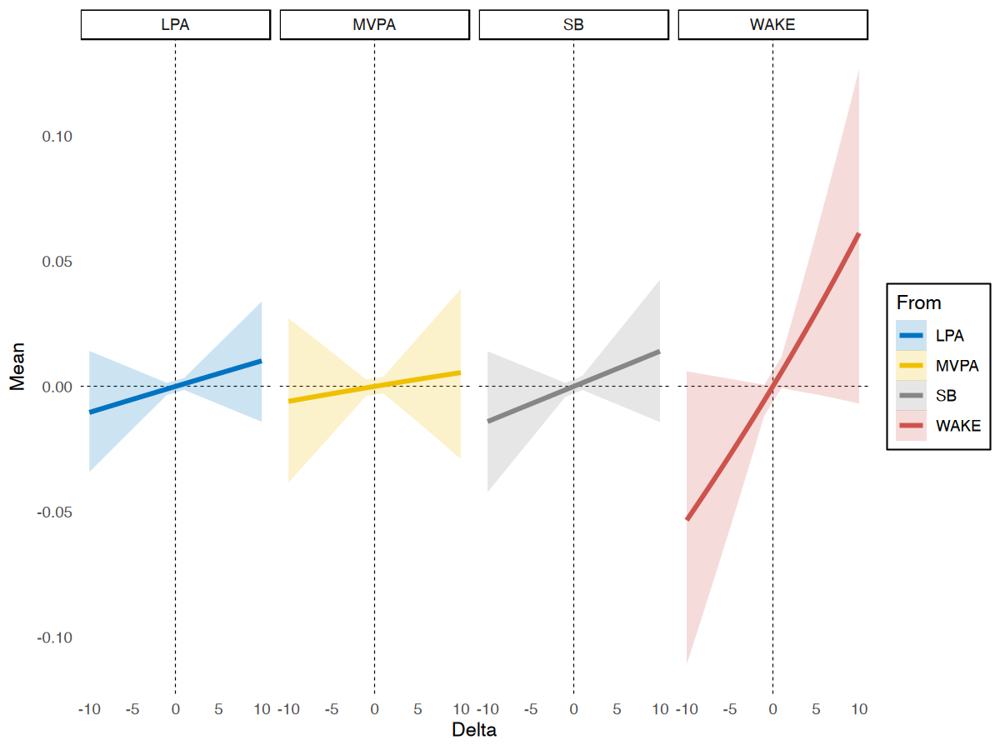

# Intro
We often are interested in how an outcome changes when a fixed unit of the predictor 
(e.g., minutes of behaviours during a day) is reallocated
from one compositional component to another. 
The Compositional Isotemporal Substitution Model can be used to estimate this change. 
The `multilevelcoda` package implements this method in a multilevel framework and offers functions 
for both between- and within-person levels of variability. We discuss 4 different substitution models in this vignette.

We will begin by loading necessary packages, `multilevelcoda`, `brms` (for models fitting),
doFuture (for parallelisation), 
and data sets `mcompd` (simulated compositional sleep and wake variables),
`sbp` (sequential binary partition), and `psub` (base possible substitution).


```r
library(multilevelcoda)
library(brms)
library(doFuture)

data("mcompd") 
data("sbp")
data("psub")

options(digits = 3) # reduce number of digits shown
```

# Fitting main model
Let's fit our main `brms` model predicting `STRESS` from both between and within-person
sleep-wake behaviours (represented by isometric log ratio coordinates), with sex as a covariate, 
using the `brmcoda()` function. We can compute ILR coordinate predictors using `compilr()` function.


```r
cilr <- compilr(data = mcompd, sbp = sbp,
                parts = c("TST", "WAKE", "MVPA", "LPA", "SB"), idvar = "ID")

m <- brmcoda(compilr = cilr,
             formula = STRESS ~ bilr1 + bilr2 + bilr3 + bilr4 +
                                wilr1 + wilr2 + wilr3 + wilr4 + Female + (1 | ID),
             cores = 8, seed = 123, backend = "cmdstanr")
#> Compiling Stan program...
#> Start sampling
```

A `summary()` of the model results.


```r
summary(m$Model)
#>  Family: gaussian 
#>   Links: mu = identity; sigma = identity 
#> Formula: STRESS ~ bilr1 + bilr2 + bilr3 + bilr4 + wilr1 + wilr2 + wilr3 + wilr4 + Female + (1 | ID) 
#>    Data: tmp (Number of observations: 3540) 
#>   Draws: 4 chains, each with iter = 2000; warmup = 1000; thin = 1;
#>          total post-warmup draws = 4000
#> 
#> Group-Level Effects: 
#> ~ID (Number of levels: 266) 
#>               Estimate Est.Error l-95% CI u-95% CI Rhat Bulk_ESS
#> sd(Intercept)     0.99      0.06     0.87     1.11 1.00     1574
#>               Tail_ESS
#> sd(Intercept)     2552
#> 
#> Population-Level Effects: 
#>           Estimate Est.Error l-95% CI u-95% CI Rhat Bulk_ESS
#> Intercept     2.62      0.49     1.66     3.58 1.00     1345
#> bilr1         0.11      0.31    -0.48     0.73 1.00     1126
#> bilr2         0.52      0.33    -0.13     1.20 1.00     1366
#> bilr3         0.13      0.22    -0.30     0.55 1.00     1126
#> bilr4         0.02      0.28    -0.54     0.55 1.00      922
#> wilr1        -0.34      0.12    -0.58    -0.11 1.00     3041
#> wilr2         0.05      0.13    -0.21     0.30 1.00     3208
#> wilr3        -0.11      0.08    -0.26     0.05 1.00     3269
#> wilr4         0.24      0.10     0.04     0.44 1.00     3279
#> Female       -0.39      0.17    -0.71    -0.06 1.00     1515
#>           Tail_ESS
#> Intercept     2241
#> bilr1         2074
#> bilr2         1982
#> bilr3         1436
#> bilr4         1831
#> wilr1         2537
#> wilr2         3224
#> wilr3         3139
#> wilr4         2873
#> Female        2370
#> 
#> Family Specific Parameters: 
#>       Estimate Est.Error l-95% CI u-95% CI Rhat Bulk_ESS Tail_ESS
#> sigma     2.37      0.03     2.31     2.43 1.00     5233     2780
#> 
#> Draws were sampled using sample(hmc). For each parameter, Bulk_ESS
#> and Tail_ESS are effective sample size measures, and Rhat is the potential
#> scale reduction factor on split chains (at convergence, Rhat = 1).
```

We can see that the first and forth within-person ILR coordinates were both associated with stress. 
Interpretation for multilevel ILR coordinates can often be less intuitive. 
For example, the significant coefficient for wilr1 shows that the within-person change in sleep behaviours 
(sleep duration and time awake in bed combined), relative to wake behaviours 
(moderate to vigorous physical activity, light physical activity, and sedentary behaviour) on a given day, 
is associated with stress. However, as there are
several behaviours involved in this coordinate, we don't know the within-person change in which of 
them drives the association. It could be the change in sleep, such that people sleep more than their 
own average on a given day, but it could also be the change in time awake. Further, we don't know 
about the specific changes in time spent across behaviours. That is, if people sleep more, what 
behaviour do they spend less time in?

This is common issue when working with multilevel compositional data as ILR coordinates often 
contains information about multiple compositional components. 
To gain further insights into these associations and help with interpretation, we can conduct 
post-hoc analyses using the substitution models from our `multilevel` package.

# Substitution models

`multilevelcoda` package provides `2` different methods to compute substitution models, via the
`substitution()` function.

Basic substitution models:

- *Between-person* substitution
- *Within-person* substitution

Average marginal substitution models:

- Average marginal *between-person* substitution
- Average marginal *within-person* substitution

*Tips: Substitution models are often computationally demanding tasks. You can speed up the models using parallel execution, for example, using `doFuture` package.*

## Basic substitution model
The below example examines the changes in stress for different pairwise substitution of sleep-wake behaviours for a period of 1 to 5 minutes, at between-person level. 
We specify `level = between` to indicate substitutional change would be at the between-person level, 
and `type = conditional` to indicate basic substitution model.
If your model contains covariates, `substitution()` 
will average predictions across levels of covariates as the default.


```r
subm1 <- substitution(object = m, delta = 1:10,
                      type = "conditional", level = c("between", "within"))
```

Output from `substitution()` contains multiple data set of results for all available compositional component. 
Here are the results for changes in stress when sleep (TST) is substituted for 10 minutes.


```r
knitr::kable(subm1$BetweenpersonSub$TST[abs(Delta) == 10])
```


|   Mean| CI_low| CI_high| Delta|To  |From |Level   |EffectType  |
|------:|------:|-------:|-----:|:---|:----|:-------|:-----------|
|  0.065| -0.003|   0.134|    10|TST |WAKE |between |conditional |
|  0.005| -0.028|   0.038|    10|TST |MVPA |between |conditional |
|  0.011| -0.013|   0.035|    10|TST |LPA  |between |conditional |
|  0.014| -0.014|   0.042|    10|TST |SB   |between |conditional |
| -0.056| -0.117|   0.002|   -10|TST |WAKE |between |conditional |
| -0.005| -0.038|   0.026|   -10|TST |MVPA |between |conditional |
| -0.011| -0.035|   0.013|   -10|TST |LPA  |between |conditional |
| -0.014| -0.042|   0.013|   -10|TST |SB   |between |conditional |

None of them are significant, given that the credible intervals did not cross 0, showing that 
increasing sleep (TST) at the expense of any other behaviours was not associated 
in changes in stress at between-person level. 
These results can be plotted to see the patterns more easily using the `plotsub()` function.


```r
plotsub(data = subm1$BetweenpersonSub$TST, 
        x = "sleep", y = "stress")
```




Here are the results for within-person level.


```r
knitr::kable(subm1$WithinpersonSub$TST[abs(Delta) == 10])
```


|   Mean| CI_low| CI_high| Delta|To  |From |Level  |EffectType  |
|------:|------:|-------:|-----:|:---|:----|:------|:-----------|
|  0.037|  0.007|   0.067|    10|TST |WAKE |within |conditional |
| -0.006| -0.018|   0.006|    10|TST |MVPA |within |conditional |
| -0.010| -0.019|   0.000|    10|TST |LPA  |within |conditional |
| -0.004| -0.014|   0.006|    10|TST |SB   |within |conditional |
| -0.030| -0.056|  -0.005|   -10|TST |WAKE |within |conditional |
|  0.006| -0.005|   0.018|   -10|TST |MVPA |within |conditional |
|  0.010|  0.000|   0.019|   -10|TST |LPA  |within |conditional |
|  0.004| -0.006|   0.013|   -10|TST |SB   |within |conditional |

At within-person level, we got some significant results for substitution of sleep (TST) and time 
awake in bed (WAKE) for 5 minutes, but not other behaviours. 
Increasing 5 minutes in sleep at the expense of time spent awake 
in bed predicted 0.04 higher stress [95% CI 0.01, 0.7], on a given day. 
Conversely, less sleep and more time awake in bed predicted less stress (b = -0.03 [95% CI -0.06,	-0.01]). Let's also plot theses results.


```r
plotsub(data = subm1$WithinpersonSub$TST, x = "sleep", y = "stress")
```


## Average Marginal Substitution Effects

The average marginal models use the group- level compositional mean as the reference composition 
to obtain the average of the predicted group-level changes in the outcome when every person in the sample 
reallocates a specific unit from one compositional part to another. 
This is difference from the basic substitution model which yields prediction conditioned on 
an "average" person in the data set (by using the population- level compositional mean
as the reference composition). 
Average substitution models models are generally more computationally expensive than basic subsitution models. All models can be run faster in shorter walltime using parallel execution. 
In this example, we use package `doFuture` to parallel our models. `substitution()` will run 5 
substitution models for 5 sleep-wake behaviours, so we will parallel them across 5 workers.


```r
registerDoFuture()
plan(multisession, workers = 5)

subm2 <- substitution(object = m, delta = 1:10,
                      type = "marginal", level = c("between", "within"))
#> Error: MultisessionFuture (doFuture-2) failed to call gassign() on cluster RichSOCKnode #2 (PID 36056 on localhost 'localhost'). The reason reported was 'error writing to connection'. Post-mortem diagnostic: A process with this PID exists, which suggests that the localhost worker is still alive. Detected a non-exportable reference ('externalptr') in one of the globals ('basesub' of class 'data.table') used in the future expression. The total size of the 49 globals exported is 12.44 MiB. The three largest globals are 'object' (10.35 MiB of class 'list'), 'setDT' (522.51 KiB of class 'function') and 'clo' (281.16 KiB of class 'function')
registerDoSEQ()
```

Below are the results.


```r
knitr::kable(subm2$BetweenpersonSubMargins$TST[abs(Delta) == 10])
```


|   Mean| CI_low| CI_high| Delta|To  |From |Level   |EffectType |
|------:|------:|-------:|-----:|:---|:----|:-------|:----------|
|  0.078| -0.003|   0.162|    10|TST |WAKE |between |marginal   |
|  0.005| -0.032|   0.042|    10|TST |MVPA |between |marginal   |
|  0.011| -0.014|   0.036|    10|TST |LPA  |between |marginal   |
|  0.015| -0.015|   0.045|    10|TST |SB   |between |marginal   |
| -0.063| -0.131|   0.003|   -10|TST |WAKE |between |marginal   |
| -0.005| -0.041|   0.029|   -10|TST |MVPA |between |marginal   |
| -0.012| -0.037|   0.014|   -10|TST |LPA  |between |marginal   |
| -0.015| -0.045|   0.014|   -10|TST |SB   |between |marginal   |

```r
knitr::kable(subm2$WithinpersonSubMargins$TST[abs(Delta) == 10])
```


|   Mean| CI_low| CI_high| Delta|To  |From |Level  |EffectType |
|------:|------:|-------:|-----:|:---|:----|:------|:----------|
|  0.046|  0.009|   0.082|    10|TST |WAKE |within |marginal   |
| -0.007| -0.020|   0.006|    10|TST |MVPA |within |marginal   |
| -0.010| -0.019|   0.000|    10|TST |LPA  |within |marginal   |
| -0.004| -0.014|   0.007|    10|TST |SB   |within |marginal   |
| -0.035| -0.064|  -0.006|   -10|TST |WAKE |within |marginal   |
|  0.007| -0.006|   0.019|   -10|TST |MVPA |within |marginal   |
|  0.010|  0.000|   0.019|   -10|TST |LPA  |within |marginal   |
|  0.004| -0.007|   0.014|   -10|TST |SB   |within |marginal   |

A comparison between between- and within-person substitution model of sleep on stress, 
plot using `plotsub()` and `ggpubr::ggarrange()` functions.


```r
library(ggpubr)
p1 <- plotsub(data = subm2$BetweenpersonSubMargins$TST, x = "between-person sleep", y = "stress")
p2 <- plotsub(data = subm2$WithinpersonSubMargins$TST, x = "within-person sleep", y = "stress")

ggarrange(p1, p2, 
          ncol = 1, nrow = 2)
```


