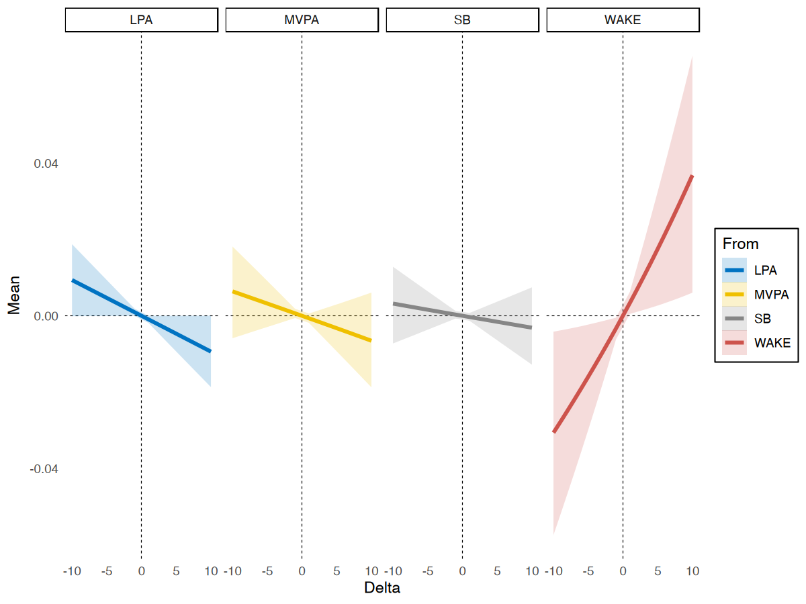

# Intro
We often are interested in how an outcome changes when a fixed unit of the predictor 
(e.g., minutes of behaviours during a day) is reallocated
from one compositional component to another. 
The Compositional Isotemporal Substitution Model can be used to estimate this change. 
The `multilevelcoda` package implements this method in a multilevel framework and offers functions 
for both between- and within-person levels of variability. We discuss 4 different substitution models in this vignette.

We will begin by loading necessary packages, `multilevelcoda`, `brms` (for models fitting),
doFuture (for parallelisation), 
and data sets `mcompd` (simulated compositional sleep and wake variables),
`sbp` (sequential binary partition), and `psub` (base possible substitution).


```r
library(multilevelcoda)
library(brms)
#> Loading required package: Rcpp
#> Loading 'brms' package (version 2.19.0). Useful instructions
#> can be found by typing help('brms'). A more detailed introduction
#> to the package is available through vignette('brms_overview').
#> 
#> Attaching package: 'brms'
#> The following object is masked from 'package:stats':
#> 
#>     ar
library(doFuture)
#> Loading required package: foreach
#> Loading required package: future

data("mcompd") 
data("sbp")
data("psub")

options(digits = 3) # reduce number of digits shown
```

# Fitting main model
Let's fit our main `brms` model predicting `STRESS` from both between and within-person
sleep-wake behaviours (represented by isometric log ratio coordinates), with sex as a covariate, 
using the `brmcoda()` function. We can compute ILR coordinate predictors using `compilr()` function.


```r
cilr <- compilr(data = mcompd, sbp = sbp,
                parts = c("TST", "WAKE", "MVPA", "LPA", "SB"), idvar = "ID")

m <- brmcoda(compilr = cilr,
             formula = STRESS ~ bilr1 + bilr2 + bilr3 + bilr4 +
                                wilr1 + wilr2 + wilr3 + wilr4 + Female + (1 | ID),
             cores = 8, seed = 123, backend = "cmdstanr")
#> Compiling Stan program...
#> In file included from /var/folders/fd/yjc3115x11v279rv07jxd0f40000gn/T/RtmpeJk7Sc/model-14a742a6102d2.hpp:1:
#> In file included from /Users/florale/.cmdstan/cmdstan-2.30.1/stan/src/stan/model/model_header.hpp:4:
#> In file included from /Users/florale/.cmdstan/cmdstan-2.30.1/stan/lib/stan_math/stan/math.hpp:19:
#> In file included from /Users/florale/.cmdstan/cmdstan-2.30.1/stan/lib/stan_math/stan/math/rev.hpp:10:
#> In file included from /Users/florale/.cmdstan/cmdstan-2.30.1/stan/lib/stan_math/stan/math/rev/fun.hpp:196:
#> In file included from /Users/florale/.cmdstan/cmdstan-2.30.1/stan/lib/stan_math/stan/math/prim/functor.hpp:14:
#> In file included from /Users/florale/.cmdstan/cmdstan-2.30.1/stan/lib/stan_math/stan/math/prim/functor/integrate_ode_rk45.hpp:6:
#> In file included from /Users/florale/.cmdstan/cmdstan-2.30.1/stan/lib/stan_math/stan/math/prim/functor/ode_rk45.hpp:9:
#> In file included from /Users/florale/.cmdstan/cmdstan-2.30.1/stan/lib/stan_math/lib/boost_1.78.0/boost/numeric/odeint.hpp:76:
#> In file included from /Users/florale/.cmdstan/cmdstan-2.30.1/stan/lib/stan_math/lib/boost_1.78.0/boost/numeric/odeint/integrate/observer_collection.hpp:23:
#> In file included from /Users/florale/.cmdstan/cmdstan-2.30.1/stan/lib/stan_math/lib/boost_1.78.0/boost/function.hpp:30:
#> In file included from /Users/florale/.cmdstan/cmdstan-2.30.1/stan/lib/stan_math/lib/boost_1.78.0/boost/function/detail/prologue.hpp:17:
#> In file included from /Users/florale/.cmdstan/cmdstan-2.30.1/stan/lib/stan_math/lib/boost_1.78.0/boost/function/function_base.hpp:21:
#> In file included from /Users/florale/.cmdstan/cmdstan-2.30.1/stan/lib/stan_math/lib/boost_1.78.0/boost/type_index.hpp:29:
#> In file included from /Users/florale/.cmdstan/cmdstan-2.30.1/stan/lib/stan_math/lib/boost_1.78.0/boost/type_index/stl_type_index.hpp:47:
#> /Users/florale/.cmdstan/cmdstan-2.30.1/stan/lib/stan_math/lib/boost_1.78.0/boost/container_hash/hash.hpp:132:33: warning: 'unary_function<const std::error_category *, unsigned long>' is depreca
#> ted [-Wdeprecated-declarations]
#>         struct hash_base : std::unary_function<T, std::size_t> {};
#>                                 ^
#> /Users/florale/.cmdstan/cmdstan-2.30.1/stan/lib/stan_math/lib/boost_1.78.0/boost/container_hash/hash.hpp:692:18: note: in instantiation of template class 'boost::hash_detail::hash_base<const std::error_category *>' requested here
#>         : public boost::hash_detail::hash_base<T*>
#>                  ^
#> /Users/florale/.cmdstan/cmdstan-2.30.1/stan/lib/stan_math/lib/boost_1.78.0/boost/container_hash/hash.hpp:420:24: note: in instantiation of template class 'boost::hash<const std::error_category *>' requested here
#>         boost::hash<T> hasher;
#>                        ^
#> /Users/florale/.cmdstan/cmdstan-2.30.1/stan/lib/stan_math/lib/boost_1.78.0/boost/container_hash/hash.hpp:551:9: note: in instantiation of function template specialization 'boost::hash_combine<const std::error_category *>' requested here
#>         hash_combine(seed, &v.category());
#>         ^
#> /Applications/Xcode.app/Contents/Developer/Platforms/MacOSX.platform/Developer/SDKs/MacOSX.sdk/usr/include/c++/v1/__functional/unary_function.h:23:29: note: 'unary_function<const std::error_category *, unsigned long>' has been explicitly marked deprecated here
#> struct _LIBCPP_TEMPLATE_VIS _LIBCPP_DEPRECATED_IN_CXX11 unary_function
#>                             ^
#> /Applications/Xcode.app/Contents/Developer/Platforms/MacOSX.platform/Developer/SDKs/MacOSX.sdk/usr/include/c++/v1/__config:825:41: note: expanded from macro '_LIBCPP_DEPRECATED_IN_CXX11'
#> #    define _LIBCPP_DEPRECATED_IN_CXX11 _LIBCPP_DEPRECATED
#>                                         ^
#> /Applications/Xcode.app/Contents/Developer/Platforms/MacOSX.platform/Developer/SDKs/MacOSX.sdk/usr/include/c++/v1/__config:810:49: note: expanded from macro '_LIBCPP_DEPRECATED'
#> #      define _LIBCPP_DEPRECATED __attribute__((deprecated))
#>                                                 ^
#> 1 warning generated.
#> Start sampling
#> Chain 1 Informational Message: The current Metropolis proposal is about to be rejected because of the following issue:
#> Chain 1 Exception: normal_id_glm_lpdf: Scale vector is 0, but must be positive finite! (in '/var/folders/fd/yjc3115x11v279rv07jxd0f40000gn/T/RtmpeJk7Sc/model-14a742a6102d2.stan', line 54, column 4 to column 55)
#> Chain 1 If this warning occurs sporadically, such as for highly constrained variable types like covariance matrices, then the sampler is fine,
#> Chain 1 but if this warning occurs often then your model may be either severely ill-conditioned or misspecified.
#> Chain 1
#> Chain 1 Informational Message: The current Metropolis proposal is about to be rejected because of the following issue:
#> Chain 1 Exception: normal_id_glm_lpdf: Scale vector is 0, but must be positive finite! (in '/var/folders/fd/yjc3115x11v279rv07jxd0f40000gn/T/RtmpeJk7Sc/model-14a742a6102d2.stan', line 54, column 4 to column 55)
#> Chain 1 If this warning occurs sporadically, such as for highly constrained variable types like covariance matrices, then the sampler is fine,
#> Chain 1 but if this warning occurs often then your model may be either severely ill-conditioned or misspecified.
#> Chain 1
#> Chain 1 Informational Message: The current Metropolis proposal is about to be rejected because of the following issue:
#> Chain 1 Exception: normal_id_glm_lpdf: Scale vector is inf, but must be positive finite! (in '/var/folders/fd/yjc3115x11v279rv07jxd0f40000gn/T/RtmpeJk7Sc/model-14a742a6102d2.stan', line 54, column 4 to column 55)
#> Chain 1 If this warning occurs sporadically, such as for highly constrained variable types like covariance matrices, then the sampler is fine,
#> Chain 1 but if this warning occurs often then your model may be either severely ill-conditioned or misspecified.
#> Chain 1
#> Chain 2 Informational Message: The current Metropolis proposal is about to be rejected because of the following issue:
#> Chain 2 Exception: normal_id_glm_lpdf: Scale vector is 0, but must be positive finite! (in '/var/folders/fd/yjc3115x11v279rv07jxd0f40000gn/T/RtmpeJk7Sc/model-14a742a6102d2.stan', line 54, column 4 to column 55)
#> Chain 2 If this warning occurs sporadically, such as for highly constrained variable types like covariance matrices, then the sampler is fine,
#> Chain 2 but if this warning occurs often then your model may be either severely ill-conditioned or misspecified.
#> Chain 2
#> Chain 2 Informational Message: The current Metropolis proposal is about to be rejected because of the following issue:
#> Chain 2 Exception: normal_id_glm_lpdf: Scale vector is 0, but must be positive finite! (in '/var/folders/fd/yjc3115x11v279rv07jxd0f40000gn/T/RtmpeJk7Sc/model-14a742a6102d2.stan', line 54, column 4 to column 55)
#> Chain 2 If this warning occurs sporadically, such as for highly constrained variable types like covariance matrices, then the sampler is fine,
#> Chain 2 but if this warning occurs often then your model may be either severely ill-conditioned or misspecified.
#> Chain 2
#> Chain 2 Informational Message: The current Metropolis proposal is about to be rejected because of the following issue:
#> Chain 2 Exception: normal_id_glm_lpdf: Scale vector is inf, but must be positive finite! (in '/var/folders/fd/yjc3115x11v279rv07jxd0f40000gn/T/RtmpeJk7Sc/model-14a742a6102d2.stan', line 54, column 4 to column 55)
#> Chain 2 If this warning occurs sporadically, such as for highly constrained variable types like covariance matrices, then the sampler is fine,
#> Chain 2 but if this warning occurs often then your model may be either severely ill-conditioned or misspecified.
#> Chain 2
#> Chain 2 Informational Message: The current Metropolis proposal is about to be rejected because of the following issue:
#> Chain 2 Exception: normal_id_glm_lpdf: Scale vector is inf, but must be positive finite! (in '/var/folders/fd/yjc3115x11v279rv07jxd0f40000gn/T/RtmpeJk7Sc/model-14a742a6102d2.stan', line 54, column 4 to column 55)
#> Chain 2 If this warning occurs sporadically, such as for highly constrained variable types like covariance matrices, then the sampler is fine,
#> Chain 2 but if this warning occurs often then your model may be either severely ill-conditioned or misspecified.
#> Chain 2
#> Chain 3 Informational Message: The current Metropolis proposal is about to be rejected because of the following issue:
#> Chain 3 Exception: normal_id_glm_lpdf: Scale vector is inf, but must be positive finite! (in '/var/folders/fd/yjc3115x11v279rv07jxd0f40000gn/T/RtmpeJk7Sc/model-14a742a6102d2.stan', line 54, column 4 to column 55)
#> Chain 3 If this warning occurs sporadically, such as for highly constrained variable types like covariance matrices, then the sampler is fine,
#> Chain 3 but if this warning occurs often then your model may be either severely ill-conditioned or misspecified.
#> Chain 3
#> Chain 3 Informational Message: The current Metropolis proposal is about to be rejected because of the following issue:
#> Chain 3 Exception: normal_id_glm_lpdf: Scale vector is inf, but must be positive finite! (in '/var/folders/fd/yjc3115x11v279rv07jxd0f40000gn/T/RtmpeJk7Sc/model-14a742a6102d2.stan', line 54, column 4 to column 55)
#> Chain 3 If this warning occurs sporadically, such as for highly constrained variable types like covariance matrices, then the sampler is fine,
#> Chain 3 but if this warning occurs often then your model may be either severely ill-conditioned or misspecified.
#> Chain 3
#> Chain 3 Informational Message: The current Metropolis proposal is about to be rejected because of the following issue:
#> Chain 3 Exception: normal_id_glm_lpdf: Scale vector is inf, but must be positive finite! (in '/var/folders/fd/yjc3115x11v279rv07jxd0f40000gn/T/RtmpeJk7Sc/model-14a742a6102d2.stan', line 54, column 4 to column 55)
#> Chain 3 If this warning occurs sporadically, such as for highly constrained variable types like covariance matrices, then the sampler is fine,
#> Chain 3 but if this warning occurs often then your model may be either severely ill-conditioned or misspecified.
#> Chain 3
#> Chain 3 Informational Message: The current Metropolis proposal is about to be rejected because of the following issue:
#> Chain 3 Exception: normal_id_glm_lpdf: Scale vector is inf, but must be positive finite! (in '/var/folders/fd/yjc3115x11v279rv07jxd0f40000gn/T/RtmpeJk7Sc/model-14a742a6102d2.stan', line 54, column 4 to column 55)
#> Chain 3 If this warning occurs sporadically, such as for highly constrained variable types like covariance matrices, then the sampler is fine,
#> Chain 3 but if this warning occurs often then your model may be either severely ill-conditioned or misspecified.
#> Chain 3
#> Chain 3 Informational Message: The current Metropolis proposal is about to be rejected because of the following issue:
#> Chain 3 Exception: normal_id_glm_lpdf: Scale vector is inf, but must be positive finite! (in '/var/folders/fd/yjc3115x11v279rv07jxd0f40000gn/T/RtmpeJk7Sc/model-14a742a6102d2.stan', line 54, column 4 to column 55)
#> Chain 3 If this warning occurs sporadically, such as for highly constrained variable types like covariance matrices, then the sampler is fine,
#> Chain 3 but if this warning occurs often then your model may be either severely ill-conditioned or misspecified.
#> Chain 3
#> Chain 3 Informational Message: The current Metropolis proposal is about to be rejected because of the following issue:
#> Chain 3 Exception: normal_id_glm_lpdf: Scale vector is inf, but must be positive finite! (in '/var/folders/fd/yjc3115x11v279rv07jxd0f40000gn/T/RtmpeJk7Sc/model-14a742a6102d2.stan', line 54, column 4 to column 55)
#> Chain 3 If this warning occurs sporadically, such as for highly constrained variable types like covariance matrices, then the sampler is fine,
#> Chain 3 but if this warning occurs often then your model may be either severely ill-conditioned or misspecified.
#> Chain 3
#> Chain 3 Informational Message: The current Metropolis proposal is about to be rejected because of the following issue:
#> Chain 3 Exception: normal_id_glm_lpdf: Scale vector is inf, but must be positive finite! (in '/var/folders/fd/yjc3115x11v279rv07jxd0f40000gn/T/RtmpeJk7Sc/model-14a742a6102d2.stan', line 54, column 4 to column 55)
#> Chain 3 If this warning occurs sporadically, such as for highly constrained variable types like covariance matrices, then the sampler is fine,
#> Chain 3 but if this warning occurs often then your model may be either severely ill-conditioned or misspecified.
#> Chain 3
#> Chain 3 Informational Message: The current Metropolis proposal is about to be rejected because of the following issue:
#> Chain 3 Exception: normal_id_glm_lpdf: Scale vector is inf, but must be positive finite! (in '/var/folders/fd/yjc3115x11v279rv07jxd0f40000gn/T/RtmpeJk7Sc/model-14a742a6102d2.stan', line 54, column 4 to column 55)
#> Chain 3 If this warning occurs sporadically, such as for highly constrained variable types like covariance matrices, then the sampler is fine,
#> Chain 3 but if this warning occurs often then your model may be either severely ill-conditioned or misspecified.
#> Chain 3
#> Chain 4 Informational Message: The current Metropolis proposal is about to be rejected because of the following issue:
#> Chain 4 Exception: normal_id_glm_lpdf: Scale vector is inf, but must be positive finite! (in '/var/folders/fd/yjc3115x11v279rv07jxd0f40000gn/T/RtmpeJk7Sc/model-14a742a6102d2.stan', line 54, column 4 to column 55)
#> Chain 4 If this warning occurs sporadically, such as for highly constrained variable types like covariance matrices, then the sampler is fine,
#> Chain 4 but if this warning occurs often then your model may be either severely ill-conditioned or misspecified.
#> Chain 4
#> Chain 4 Informational Message: The current Metropolis proposal is about to be rejected because of the following issue:
#> Chain 4 Exception: normal_id_glm_lpdf: Scale vector is inf, but must be positive finite! (in '/var/folders/fd/yjc3115x11v279rv07jxd0f40000gn/T/RtmpeJk7Sc/model-14a742a6102d2.stan', line 54, column 4 to column 55)
#> Chain 4 If this warning occurs sporadically, such as for highly constrained variable types like covariance matrices, then the sampler is fine,
#> Chain 4 but if this warning occurs often then your model may be either severely ill-conditioned or misspecified.
#> Chain 4
#> Chain 4 Informational Message: The current Metropolis proposal is about to be rejected because of the following issue:
#> Chain 4 Exception: normal_id_glm_lpdf: Scale vector is inf, but must be positive finite! (in '/var/folders/fd/yjc3115x11v279rv07jxd0f40000gn/T/RtmpeJk7Sc/model-14a742a6102d2.stan', line 54, column 4 to column 55)
#> Chain 4 If this warning occurs sporadically, such as for highly constrained variable types like covariance matrices, then the sampler is fine,
#> Chain 4 but if this warning occurs often then your model may be either severely ill-conditioned or misspecified.
#> Chain 4
#> Chain 4 Informational Message: The current Metropolis proposal is about to be rejected because of the following issue:
#> Chain 4 Exception: normal_id_glm_lpdf: Scale vector is inf, but must be positive finite! (in '/var/folders/fd/yjc3115x11v279rv07jxd0f40000gn/T/RtmpeJk7Sc/model-14a742a6102d2.stan', line 54, column 4 to column 55)
#> Chain 4 If this warning occurs sporadically, such as for highly constrained variable types like covariance matrices, then the sampler is fine,
#> Chain 4 but if this warning occurs often then your model may be either severely ill-conditioned or misspecified.
#> Chain 4
#> Chain 4 Informational Message: The current Metropolis proposal is about to be rejected because of the following issue:
#> Chain 4 Exception: normal_id_glm_lpdf: Scale vector is inf, but must be positive finite! (in '/var/folders/fd/yjc3115x11v279rv07jxd0f40000gn/T/RtmpeJk7Sc/model-14a742a6102d2.stan', line 54, column 4 to column 55)
#> Chain 4 If this warning occurs sporadically, such as for highly constrained variable types like covariance matrices, then the sampler is fine,
#> Chain 4 but if this warning occurs often then your model may be either severely ill-conditioned or misspecified.
#> Chain 4
#> Chain 4 Informational Message: The current Metropolis proposal is about to be rejected because of the following issue:
#> Chain 4 Exception: normal_id_glm_lpdf: Scale vector is inf, but must be positive finite! (in '/var/folders/fd/yjc3115x11v279rv07jxd0f40000gn/T/RtmpeJk7Sc/model-14a742a6102d2.stan', line 54, column 4 to column 55)
#> Chain 4 If this warning occurs sporadically, such as for highly constrained variable types like covariance matrices, then the sampler is fine,
#> Chain 4 but if this warning occurs often then your model may be either severely ill-conditioned or misspecified.
#> Chain 4
#> Chain 4 Informational Message: The current Metropolis proposal is about to be rejected because of the following issue:
#> Chain 4 Exception: normal_id_glm_lpdf: Scale vector is inf, but must be positive finite! (in '/var/folders/fd/yjc3115x11v279rv07jxd0f40000gn/T/RtmpeJk7Sc/model-14a742a6102d2.stan', line 54, column 4 to column 55)
#> Chain 4 If this warning occurs sporadically, such as for highly constrained variable types like covariance matrices, then the sampler is fine,
#> Chain 4 but if this warning occurs often then your model may be either severely ill-conditioned or misspecified.
#> Chain 4
#> Chain 4 Informational Message: The current Metropolis proposal is about to be rejected because of the following issue:
#> Chain 4 Exception: normal_id_glm_lpdf: Scale vector is inf, but must be positive finite! (in '/var/folders/fd/yjc3115x11v279rv07jxd0f40000gn/T/RtmpeJk7Sc/model-14a742a6102d2.stan', line 54, column 4 to column 55)
#> Chain 4 If this warning occurs sporadically, such as for highly constrained variable types like covariance matrices, then the sampler is fine,
#> Chain 4 but if this warning occurs often then your model may be either severely ill-conditioned or misspecified.
#> Chain 4
#> Chain 4 Informational Message: The current Metropolis proposal is about to be rejected because of the following issue:
#> Chain 4 Exception: normal_id_glm_lpdf: Scale vector is inf, but must be positive finite! (in '/var/folders/fd/yjc3115x11v279rv07jxd0f40000gn/T/RtmpeJk7Sc/model-14a742a6102d2.stan', line 54, column 4 to column 55)
#> Chain 4 If this warning occurs sporadically, such as for highly constrained variable types like covariance matrices, then the sampler is fine,
#> Chain 4 but if this warning occurs often then your model may be either severely ill-conditioned or misspecified.
#> Chain 4
#> Chain 4 Informational Message: The current Metropolis proposal is about to be rejected because of the following issue:
#> Chain 4 Exception: normal_id_glm_lpdf: Scale vector is inf, but must be positive finite! (in '/var/folders/fd/yjc3115x11v279rv07jxd0f40000gn/T/RtmpeJk7Sc/model-14a742a6102d2.stan', line 54, column 4 to column 55)
#> Chain 4 If this warning occurs sporadically, such as for highly constrained variable types like covariance matrices, then the sampler is fine,
#> Chain 4 but if this warning occurs often then your model may be either severely ill-conditioned or misspecified.
#> Chain 4
```

A `summary()` of the model results.


```r
summary(m$Model)
#>  Family: gaussian 
#>   Links: mu = identity; sigma = identity 
#> Formula: STRESS ~ bilr1 + bilr2 + bilr3 + bilr4 + wilr1 + wilr2 + wilr3 + wilr4 + Female + (1 | ID) 
#>    Data: tmp (Number of observations: 3540) 
#>   Draws: 4 chains, each with iter = 2000; warmup = 1000; thin = 1;
#>          total post-warmup draws = 4000
#> 
#> Group-Level Effects: 
#> ~ID (Number of levels: 266) 
#>               Estimate Est.Error l-95% CI u-95% CI Rhat Bulk_ESS Tail_ESS
#> sd(Intercept)     0.99      0.06     0.87     1.11 1.00     1179     2176
#> 
#> Population-Level Effects: 
#>           Estimate Est.Error l-95% CI u-95% CI Rhat Bulk_ESS Tail_ESS
#> Intercept     2.64      0.47     1.68     3.57 1.00     1429     2263
#> bilr1         0.12      0.33    -0.54     0.77 1.00      971     1409
#> bilr2         0.53      0.35    -0.16     1.21 1.00     1124     1679
#> bilr3         0.13      0.21    -0.29     0.55 1.00     1052     1809
#> bilr4        -0.01      0.29    -0.57     0.55 1.00     1021     1941
#> wilr1        -0.34      0.12    -0.58    -0.10 1.00     2990     3206
#> wilr2         0.05      0.13    -0.21     0.31 1.00     3396     3077
#> wilr3        -0.10      0.08    -0.25     0.04 1.00     2900     3218
#> wilr4         0.23      0.10     0.04     0.43 1.00     2894     3220
#> Female       -0.39      0.17    -0.74    -0.08 1.00     1405     1697
#> 
#> Family Specific Parameters: 
#>       Estimate Est.Error l-95% CI u-95% CI Rhat Bulk_ESS Tail_ESS
#> sigma     2.37      0.03     2.31     2.43 1.00     4462     2814
#> 
#> Draws were sampled using sample(hmc). For each parameter, Bulk_ESS
#> and Tail_ESS are effective sample size measures, and Rhat is the potential
#> scale reduction factor on split chains (at convergence, Rhat = 1).
```

We can see that the first and forth within-person ILR coordinates were both associated with stress. 
Interpretation for multilevel ILR coordinates can often be less intuitive. 
For example, the significant coefficient for wilr1 shows that the within-person change in sleep behaviours 
(sleep duration and time awake in bed combined), relative to wake behaviours 
(moderate to vigorous physical activity, light physical activity, and sedentary behaviour) on a given day, 
is associated with stress. However, as there are
several behaviours involved in this coordinate, we don't know the within-person change in which of 
them drives the association. It could be the change in sleep, such that people sleep more than their 
own average on a given day, but it could also be the change in time awake. Further, we don't know 
about the specific changes in time spent across behaviours. That is, if people sleep more, what 
behaviour do they spend less time in?

This is common issue when working with multilevel compositional data as ILR coordinates often 
contains information about multiple compositional components. 
To gain further insights into these associations and help with interpretation, we can conduct 
post-hoc analyses using the substitution models from our `multilevel` package.

# Substitution models

`multilevelcoda` package provides `2` different methods to compute substitution models, via the
`substitution()` function.

Basic substitution models:

- *Between-person* substitution
- *Within-person* substitution

Average marginal substitution models:

- Average marginal *between-person* substitution
- Average marginal *within-person* substitution

*Tips: Substitution models are often computationally demanding tasks. You can speed up the models using parallel execution, for example, using `doFuture` package.*

## Basic substitution model
The below example examines the changes in stress for different pairwise substitution of sleep-wake behaviours for a period of 1 to 5 minutes, at between-person level. 
We specify `level = between` to indicate substitutional change would be at the between-person level, 
and `type = conditional` to indicate basic substitution model.
If your model contains covariates, `substitution()` 
will average predictions across levels of covariates as the default.


```r
subm1 <- substitution(object = m, delta = 1:10,
                      type = "conditional", level = c("between", "within"))
#> Warning: executing %dopar% sequentially: no parallel backend registered
```

Output from `substitution()` contains multiple data set of results for all available compositional component. 
Here are the results for changes in stress when sleep (TST) is substituted for 10 minutes.


```r
knitr::kable(subm1$BetweenSub$TST[abs(Delta) == 10])
```


|   Mean| CI_low| CI_high| Delta|To  |From |Level   |EffectType  |
|------:|------:|-------:|-----:|:---|:----|:-------|:-----------|
|  0.064| -0.004|   0.132|    10|TST |WAKE |between |conditional |
|  0.005| -0.029|   0.039|    10|TST |MVPA |between |conditional |
|  0.012| -0.014|   0.037|    10|TST |LPA  |between |conditional |
|  0.014| -0.017|   0.043|    10|TST |SB   |between |conditional |
| -0.056| -0.116|   0.004|   -10|TST |WAKE |between |conditional |
| -0.006| -0.038|   0.027|   -10|TST |MVPA |between |conditional |
| -0.012| -0.037|   0.014|   -10|TST |LPA  |between |conditional |
| -0.014| -0.042|   0.016|   -10|TST |SB   |between |conditional |

None of them are significant, given that the credible intervals did not cross 0, showing that 
increasing sleep (TST) at the expense of any other behaviours was not associated 
in changes in stress at between-person level. 
These results can be plotted to see the patterns more easily using the `plotsub()` function.


```r
plotsub(data = subm1$BetweenSub$TST, 
        x = "sleep", y = "stress")
```


```
#> Error in theme(panel.background = element_rect(fill = "transparent"), : could not find function "theme"
```

Here are the results for within-person level.


```r
knitr::kable(subm1$WithinSub$TST[abs(Delta) == 10])
```


|   Mean| CI_low| CI_high| Delta|To  |From |Level  |EffectType  |
|------:|------:|-------:|-----:|:---|:----|:------|:-----------|
|  0.036|  0.004|   0.067|    10|TST |WAKE |within |conditional |
| -0.006| -0.019|   0.006|    10|TST |MVPA |within |conditional |
| -0.009| -0.019|   0.000|    10|TST |LPA  |within |conditional |
| -0.003| -0.014|   0.007|    10|TST |SB   |within |conditional |
| -0.030| -0.057|  -0.003|   -10|TST |WAKE |within |conditional |
|  0.006| -0.006|   0.018|   -10|TST |MVPA |within |conditional |
|  0.009|  0.000|   0.019|   -10|TST |LPA  |within |conditional |
|  0.004| -0.006|   0.014|   -10|TST |SB   |within |conditional |

At within-person level, we got some significant results for substitution of sleep (TST) and time 
awake in bed (WAKE) for 5 minutes, but not other behaviours. 
Increasing 5 minutes in sleep at the expense of time spent awake 
in bed predicted 0.04 higher stress [95% CI 0.01, 0.7], on a given day. 
Conversely, less sleep and more time awake in bed predicted less stress (b = -0.03 [95% CI -0.06,	-0.01]). Let's also plot theses results.


```r
plotsub(data = subm1$WithinSub$TST, x = "sleep", y = "stress")
```




## Average Marginal Substitution Effects

The average marginal models use the group- level compositional mean as the reference composition 
to obtain the average of the predicted group-level changes in the outcome when every person in the sample 
reallocates a specific unit from one compositional part to another. 
This is difference from the basic substitution model which yields prediction conditioned on 
an "average" person in the data set (by using the population- level compositional mean
as the reference composition). 
Average substitution models models are generally more computationally expensive than basic subsitution models. All models can be run faster in shorter walltime using parallel execution. 
In this example, we use package `doFuture` to parallel our models. `substitution()` will run 5 
substitution models for 5 sleep-wake behaviours, so we will parallel them across 5 workers.


```r
registerDoFuture()
plan(multisession, workers = 5)

subm2 <- substitution(object = m, delta = 1:10,
                      type = "marginal", level = c("between", "within"))
registerDoSEQ()
```

Below are the results.


```r
knitr::kable(subm2$BetweenSubMargins$TST[abs(Delta) == 10])
```


|   Mean| CI_low| CI_high| Delta|To  |From |Level   |EffectType |
|------:|------:|-------:|-----:|:---|:----|:-------|:----------|
|  0.077| -0.006|   0.159|    10|TST |WAKE |between |marginal   |
|  0.005| -0.033|   0.042|    10|TST |MVPA |between |marginal   |
|  0.012| -0.015|   0.038|    10|TST |LPA  |between |marginal   |
|  0.014| -0.018|   0.045|    10|TST |SB   |between |marginal   |
| -0.062| -0.129|   0.004|   -10|TST |WAKE |between |marginal   |
| -0.005| -0.041|   0.031|   -10|TST |MVPA |between |marginal   |
| -0.012| -0.039|   0.015|   -10|TST |LPA  |between |marginal   |
| -0.014| -0.045|   0.018|   -10|TST |SB   |between |marginal   |

```r
knitr::kable(subm2$WithinSubMargins$TST[abs(Delta) == 10])
```


|   Mean| CI_low| CI_high| Delta|To  |From |Level  |EffectType |
|------:|------:|-------:|-----:|:---|:----|:------|:----------|
|  0.046|  0.007|   0.083|    10|TST |WAKE |within |marginal   |
| -0.007| -0.021|   0.007|    10|TST |MVPA |within |marginal   |
| -0.010| -0.020|   0.000|    10|TST |LPA  |within |marginal   |
| -0.004| -0.014|   0.007|    10|TST |SB   |within |marginal   |
| -0.035| -0.064|  -0.004|   -10|TST |WAKE |within |marginal   |
|  0.007| -0.007|   0.020|   -10|TST |MVPA |within |marginal   |
|  0.010|  0.000|   0.020|   -10|TST |LPA  |within |marginal   |
|  0.004| -0.007|   0.014|   -10|TST |SB   |within |marginal   |

A comparison between between- and within-person substitution model of sleep on stress, 
plot using `plotsub()` and `ggpubr::ggarrange()` functions.


```r
library(ggpubr)
p1 <- plotsub(data = subm2$BetweenSubMargins$TST, x = "between-person sleep", y = "stress")
p2 <- plotsub(data = subm2$WithinSubMargins$TST, x = "within-person sleep", y = "stress")

ggarrange(p1, p2, 
          ncol = 1, nrow = 2)
```


```
#> Loading required package: ggplot2
#> 
#> Attaching package: 'ggpubr'
#> The following object is masked from 'package:cowplot':
#> 
#>     get_legend
```


